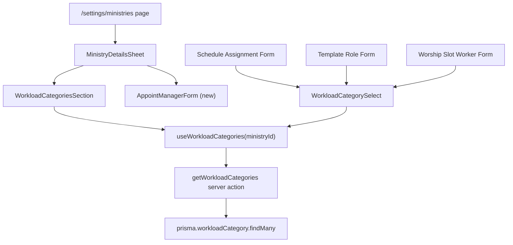

# Design Document: Ministry Management — Workload Categories

## Overview

This feature extends the Ministry Management module in the COG App (`apps/web`) to support **Workload Categories** — per-ministry, ordered groupings that classify types of work or roles within a ministry (e.g., "Guitar", "Piano", "Vocals" for a Music Ministry). It also introduces a **Ministry Manager** role: a single worker explicitly assigned to manage a specific ministry's categories and members, without requiring system-wide admin permissions.

The feature touches four layers:

1. **Database** — new `WorkloadCategory` model and `managerId` field on `Ministry`
2. **Server Actions** — CRUD + reorder for `WorkloadCategory`, assign/remove Ministry Manager
3. **React Query hooks** — `useWorkloadCategories(ministryId)` and manager assignment mutations
4. **UI** — workload categories section inside the existing ministry detail Sheet, Ministry Manager assignment form following the `AppointApproverForm` pattern, and scheduling module role dropdowns populated from categories

Access control is enforced server-side: only a Ministry Head (`headId`), Ministry Manager (`managerId`), or a worker with `canManageMinistries` may mutate categories for a given ministry.

---

## Architecture

The feature follows the existing COG App layered architecture:

```
UI (React / Next.js App Router)
  └── React Query hooks  (apps/web/src/hooks/)
        └── Server Actions  (apps/web/src/actions/)
              └── Prisma ORM  (packages/database/)
                    └── PostgreSQL (Supabase)
```

No new routes are introduced. All new UI lives inside the existing `/settings/ministries` page via Sheet panels. The scheduling module integration is additive — existing `roleName` text inputs are replaced with a smart `WorkloadCategorySelect` component that falls back to free-text when no categories exist.



---

## Components and Interfaces

### Server Actions — `apps/web/src/actions/ministry-categories.ts`

All actions perform server-side authorization before any DB operation. The authorization helper checks three conditions (any one grants access):

```typescript
async function assertCategoryManager(ministryId: string, callerId: string): Promise<void>
```

- Caller has `canManageMinistries` permission (checked via `WorkerRole` → `RolePermission`)
- Caller is the ministry's `headId`
- Caller is the ministry's `managerId`

Throws `Error('UNAUTHORIZED')` if none match, `Error('UNAUTHENTICATED')` if `callerId` is absent.

**Exported actions:**

```typescript
// Read
export async function getWorkloadCategories(ministryId: string): Promise<WorkloadCategory[]>

// Create
export async function createWorkloadCategory(data: {
  ministryId: string;
  name: string;
  description?: string;
  callerId: string;
}): Promise<WorkloadCategory>

// Update
export async function updateWorkloadCategory(id: string, data: {
  name?: string;
  description?: string;
  callerId: string;
}): Promise<WorkloadCategory>

// Delete
export async function deleteWorkloadCategory(id: string, callerId: string): Promise<void>

// Reorder — accepts full ordered list of IDs for the ministry
export async function reorderWorkloadCategories(data: {
  ministryId: string;
  orderedIds: string[];   // all category IDs in new sort order
  callerId: string;
}): Promise<void>

// Ministry Manager assignment (requires canManageMinistries)
export async function assignMinistryManager(
  ministryId: string,
  managerId: string | null,
  callerId: string,
): Promise<void>
```

`getWorkloadCategories` is intentionally unauthenticated (read-only, used by scheduling dropdowns). All mutation actions call `assertCategoryManager` before proceeding.

Duplicate name detection uses a case-insensitive unique check scoped to `ministryId`:

```typescript
const conflict = await prisma.workloadCategory.findFirst({
  where: {
    ministryId,
    name: { equals: name, mode: 'insensitive' },
    NOT: { id: existingId },   // excluded on update
  },
});
if (conflict) throw new Error('DUPLICATE_NAME');
```

### React Query Hook — `apps/web/src/hooks/use-workload-categories.ts`

```typescript
export function useWorkloadCategories(ministryId: string) {
  const qc = useQueryClient();
  const key = ['workload-categories', ministryId];

  const { data, isLoading } = useQuery({
    queryKey: key,
    queryFn: () => getWorkloadCategories(ministryId),
    enabled: !!ministryId,
    staleTime: 2 * 60_000,
  });

  const createMutation   = useMutation({ mutationFn: createWorkloadCategory,   onSuccess: () => qc.invalidateQueries({ queryKey: key }) });
  const updateMutation   = useMutation({ mutationFn: ({ id, data }) => updateWorkloadCategory(id, data), onSuccess: () => qc.invalidateQueries({ queryKey: key }) });
  const deleteMutation   = useMutation({ mutationFn: ({ id, callerId }) => deleteWorkloadCategory(id, callerId), onSuccess: () => qc.invalidateQueries({ queryKey: key }) });
  const reorderMutation  = useMutation({ mutationFn: reorderWorkloadCategories, onSuccess: () => qc.invalidateQueries({ queryKey: key }) });

  return {
    categories: data ?? [],
    isLoading,
    createCategory:  createMutation.mutateAsync,
    updateCategory:  updateMutation.mutateAsync,
    deleteCategory:  deleteMutation.mutateAsync,
    reorderCategories: reorderMutation.mutateAsync,
  };
}
```

The `useMinistries` hook gains a `assignMinistryManager` mutation that calls the new server action and invalidates `['ministries']`.

### UI Components

#### `WorkloadCategoriesSection`

Rendered inside `MinistryDetailsSheet` when the viewer is a Category Manager for that ministry. Structure:

- Header row: "Workload Categories" label + "Add Category" button (visible to Category Managers only)
- Ordered list of `WorkloadCategoryRow` items, each showing name, optional description, drag handle (reorder), edit button, delete button
- Empty state: "No categories defined yet." with an add prompt
- Inline `WorkloadCategoryForm` (Sheet or inline expand) for create/edit with name input and description textarea
- `AlertDialog` confirmation before delete (matches existing pattern in ministries page)

Reordering uses a simple up/down button pair (no drag-and-drop library dependency) that calls `reorderCategories` with the updated `orderedIds` array.

#### `AppointManagerForm`

Follows the existing `AppointApproverForm` pattern exactly:

```typescript
const AppointManagerForm = ({
  ministry,
  workers,
  onSave,
  onClose,
}: {
  ministry: Ministry;
  workers: Worker[];
  onSave: (ministryId: string, managerId: string | null) => void;
  onClose: () => void;
}) => { ... }
```

- Renders inside the existing `Sheet` used for appointments
- Adds a new `DropdownMenuItem` "Appoint Ministry Manager" in the ministry card's `DropdownMenu` (visible only to workers with `canManageMinistries`)
- Selecting "None" removes the manager assignment

#### `WorkloadCategorySelect`

A smart select/input component used in scheduling forms:

```typescript
interface WorkloadCategorySelectProps {
  ministryId: string;
  value: string;
  onChange: (value: string) => void;
  placeholder?: string;
}
```

- Calls `useWorkloadCategories(ministryId)` internally
- When `categories.length > 0`: renders a `Select` with category names as options, ordered by `sortOrder`
- When `categories.length === 0` or `ministryId` is empty: renders a plain `Input` for free-text entry
- Used in: `ScheduleAssignment` form (replaces `roleName` text input), `TemplateRole` form (replaces `roleName` text input), `WorshipSlotWorker` form (replaces `role` text input)

---

## Data Models

### Prisma Schema Changes

**New model: `WorkloadCategory`**

```prisma
model WorkloadCategory {
  id          String   @id @default(uuid())
  ministryId  String
  name        String
  description String?  @db.VarChar(255)
  sortOrder   Int      @default(0)
  createdAt   DateTime @default(now())
  updatedAt   DateTime @updatedAt

  @@unique([ministryId, name])   // enforced at DB level (case-sensitive; app layer handles case-insensitive check)
  @@index([ministryId, sortOrder])
}
```

The `@@unique([ministryId, name])` constraint provides a DB-level safety net. The application layer performs a case-insensitive check before attempting the insert/update to return a user-friendly error rather than a Prisma constraint violation.

**Modified model: `Ministry`**

```prisma
model Ministry {
  id                  String     @id @default(uuid())
  name                String
  description         String
  departmentCode      String
  leaderId            String
  headId              String?
  approverId          String?
  schedulerId         String?
  mealStubAssignerId  String?
  managerId           String?    // NEW: Ministry Manager worker ID
  mealStubWeeklyLimit Int?
  weight              Int?
  department          Department @relation(fields: [departmentCode], references: [code])

  @@index([departmentCode])
}
```

`managerId` is a nullable `String?` (stores a `Worker.id`). No FK relation is declared to avoid cascade complexity — the application layer validates that the referenced worker exists before assignment.

### Migration

Two Prisma migrations are needed:

1. `add_workload_category` — creates the `WorkloadCategory` table
2. `add_ministry_manager_id` — adds `managerId String?` column to `Ministry`

These can be combined into a single migration file.

### TypeScript Types

The `@studio/types` package gains:

```typescript
export interface WorkloadCategory {
  id: string;
  ministryId: string;
  name: string;
  description?: string | null;
  sortOrder: number;
  createdAt: Date;
  updatedAt: Date;
}
```

The `Ministry` type gains `managerId?: string | null`.

---

## Correctness Properties

*A property is a characteristic or behavior that should hold true across all valid executions of a system — essentially, a formal statement about what the system should do. Properties serve as the bridge between human-readable specifications and machine-verifiable correctness guarantees.*

### Property 1: Category fetch returns only the ministry's own categories

*For any* ministry M and any set of categories created for M, `getWorkloadCategories(M.id)` SHALL return exactly those categories and no categories belonging to any other ministry.

**Validates: Requirements 1.1, 6.1, 6.2**

---

### Property 2: Categories are returned in sort order

*For any* ministry with N categories assigned arbitrary `sortOrder` values, `getWorkloadCategories(ministryId)` SHALL return the categories sorted ascending by `sortOrder`.

**Validates: Requirements 1.4, 5.1, 5.3, 11.5**

---

### Property 3: Create–fetch round trip

*For any* valid (non-empty, non-whitespace) category name and ministry, calling `createWorkloadCategory` then `getWorkloadCategories` SHALL return a list that includes a category with that name under that ministry.

**Validates: Requirements 2.1, 10.2**

---

### Property 4: Whitespace-only names are rejected

*For any* string composed entirely of whitespace characters (including the empty string), `createWorkloadCategory` SHALL return a validation error and leave the category list unchanged.

**Validates: Requirements 2.2**

---

### Property 5: Name uniqueness within a ministry (create and update)

*For any* ministry M and any existing category name N in M, attempting to create a second category with name N in M, or rename any other category in M to N, SHALL return a duplicate-name error and leave the existing data unchanged.

**Validates: Requirements 2.3, 3.2**

---

### Property 6: Update–fetch round trip

*For any* existing category and any valid new name, calling `updateWorkloadCategory` then `getWorkloadCategories` SHALL return a list where the category now has the new name.

**Validates: Requirements 3.1**

---

### Property 7: Delete–fetch round trip

*For any* existing category C in ministry M, calling `deleteWorkloadCategory(C.id)` then `getWorkloadCategories(M.id)` SHALL return a list that does not contain C.

**Validates: Requirements 4.1**

---

### Property 8: Reorder–fetch round trip

*For any* ministry M with N categories and any permutation of their IDs, calling `reorderWorkloadCategories` with that permutation then `getWorkloadCategories(M.id)` SHALL return the categories in the order specified by the permutation.

**Validates: Requirements 5.1, 5.3**

---

### Property 9: Ministry deletion cascades to categories

*For any* ministry M with N > 0 categories, deleting M SHALL result in zero `WorkloadCategory` records with `ministryId = M.id` remaining in the database.

**Validates: Requirements 6.3**

---

### Property 10: Ministry Manager assignment is at most one

*For any* ministry M and any sequence of `assignMinistryManager` calls, the final state of M SHALL have `managerId` equal to the argument of the last call in the sequence (or `null` if the last call passed `null`).

**Validates: Requirements 8.2, 8.3**

---

### Property 11: Unauthorized callers are rejected for all mutations

*For any* worker W who is not a Category Manager for ministry M (i.e., W is not M's `headId`, not M's `managerId`, and does not have `canManageMinistries`), every call to `createWorkloadCategory`, `updateWorkloadCategory`, `deleteWorkloadCategory`, and `reorderWorkloadCategories` for M SHALL return an `UNAUTHORIZED` error.

**Validates: Requirements 9.1, 9.3, 9.4**

---

### Property 12: Unauthenticated requests are rejected

*For any* mutation action called with an absent or empty `callerId`, the action SHALL return an `UNAUTHENTICATED` error without performing any database write.

**Validates: Requirements 9.5**

---

### Property 13: Historical scheduling records are not affected by category changes

*For any* `ScheduleAssignment`, `TemplateRole`, or `WorshipSlotWorker` record R with a `roleName`/`role` value V, renaming or deleting the `WorkloadCategory` whose name equals V SHALL leave R's stored string value unchanged.

**Validates: Requirements 11.6**

---

## Error Handling

| Error condition | Server action behavior | UI behavior |
|---|---|---|
| Unauthenticated (no `callerId`) | Throw `Error('UNAUTHENTICATED')` | Toast: "You must be logged in." |
| Unauthorized caller | Throw `Error('UNAUTHORIZED')` | Toast: "You don't have permission to manage this ministry's categories." |
| Duplicate category name | Throw `Error('DUPLICATE_NAME')` | Inline form error: "A category with this name already exists in this ministry." |
| Empty/whitespace name | Throw `Error('INVALID_NAME')` | Inline form error: "Category name cannot be empty." |
| Description > 255 chars | Throw `Error('DESCRIPTION_TOO_LONG')` | Inline form error: "Description must be 255 characters or fewer." |
| DB error (Prisma P-codes) | Re-throw with descriptive message | Toast: "An error occurred. Please try again." |
| Ministry not found | Throw `Error('MINISTRY_NOT_FOUND')` | Toast: "Ministry not found." |
| Category not found | Throw `Error('NOT_FOUND')` | Toast: "Category not found." |

All server actions wrap DB calls in try/catch. Prisma unique constraint violations (`P2002`) are caught and re-thrown as `DUPLICATE_NAME` for user-friendly handling. The UI layer maps error message strings to localized toast/inline messages.

---

## Testing Strategy

### Unit Tests (example-based)

Located in `apps/web/src/__tests__/actions/ministry-categories.test.ts`.

- `createWorkloadCategory` with valid data creates and returns the category
- `createWorkloadCategory` with empty name throws `INVALID_NAME`
- `createWorkloadCategory` with description > 255 chars throws `DESCRIPTION_TOO_LONG`
- `createWorkloadCategory` with duplicate name throws `DUPLICATE_NAME`
- `updateWorkloadCategory` with duplicate name throws `DUPLICATE_NAME`
- `deleteWorkloadCategory` removes the record
- `assignMinistryManager` with `null` clears the manager
- `AppointManagerForm` renders with current manager pre-selected
- `WorkloadCategorySelect` renders a `Select` when categories exist
- `WorkloadCategorySelect` renders an `Input` when categories list is empty
- `WorkloadCategoriesSection` shows empty state when no categories exist
- Clicking delete shows `AlertDialog` before executing

### Property-Based Tests

Located in `apps/web/src/__tests__/actions/ministry-categories.property.test.ts`.

Uses **fast-check** (already available in the JS ecosystem; install with `npm install --save-dev fast-check`). Each test runs a minimum of **100 iterations**.

Each test is tagged with a comment referencing the design property:
```typescript
// Feature: ministry-management, Property N: <property text>
```

**Properties to implement:**

| Test | Property | fast-check arbitraries |
|---|---|---|
| Category fetch isolation | Property 1 | `fc.uuid()` for ministry IDs, `fc.array(fc.string())` for names |
| Sort order preserved | Property 2 | `fc.array(fc.record({ name: fc.string(), sortOrder: fc.integer() }))` |
| Create–fetch round trip | Property 3 | `fc.string({ minLength: 1 }).filter(s => s.trim().length > 0)` |
| Whitespace rejection | Property 4 | `fc.stringOf(fc.constantFrom(' ', '\t', '\n', '\r'))` |
| Name uniqueness | Property 5 | `fc.string({ minLength: 1 })` for shared name, two ministry contexts |
| Update–fetch round trip | Property 6 | `fc.string({ minLength: 1 }).filter(s => s.trim().length > 0)` |
| Delete–fetch round trip | Property 7 | `fc.uuid()` for category IDs |
| Reorder–fetch round trip | Property 8 | `fc.shuffledSubarray(ids)` for permutations |
| Cascade delete | Property 9 | `fc.array(fc.record(...), { minLength: 1 })` |
| Manager assignment idempotence | Property 10 | `fc.array(fc.option(fc.uuid()), { minLength: 1 })` |
| Unauthorized rejection | Property 11 | `fc.uuid()` for non-manager caller IDs |
| Unauthenticated rejection | Property 12 | All four mutation actions |
| Historical record immutability | Property 13 | `fc.string()` for role names, rename/delete operations |

Property tests use an in-memory Prisma mock (via `jest-mock-extended` or a test database) to avoid real DB calls while still exercising the action logic.

### Integration Tests

- Verify `WorkloadCategory` records are persisted to PostgreSQL via Prisma
- Verify cascade delete removes categories when a ministry is deleted
- Verify `managerId` column is nullable and accepts valid worker IDs
- Verify `@@unique([ministryId, name])` constraint is enforced at DB level

### Scheduling Module Integration

- `WorkloadCategorySelect` renders correct options for a ministry with categories (example test)
- `WorkloadCategorySelect` falls back to text input for a ministry with no categories (edge case test)
- Existing `ScheduleAssignment` `roleName` is unchanged after category rename (Property 13)
- Existing `TemplateRole` `roleName` is unchanged after category delete (Property 13)
