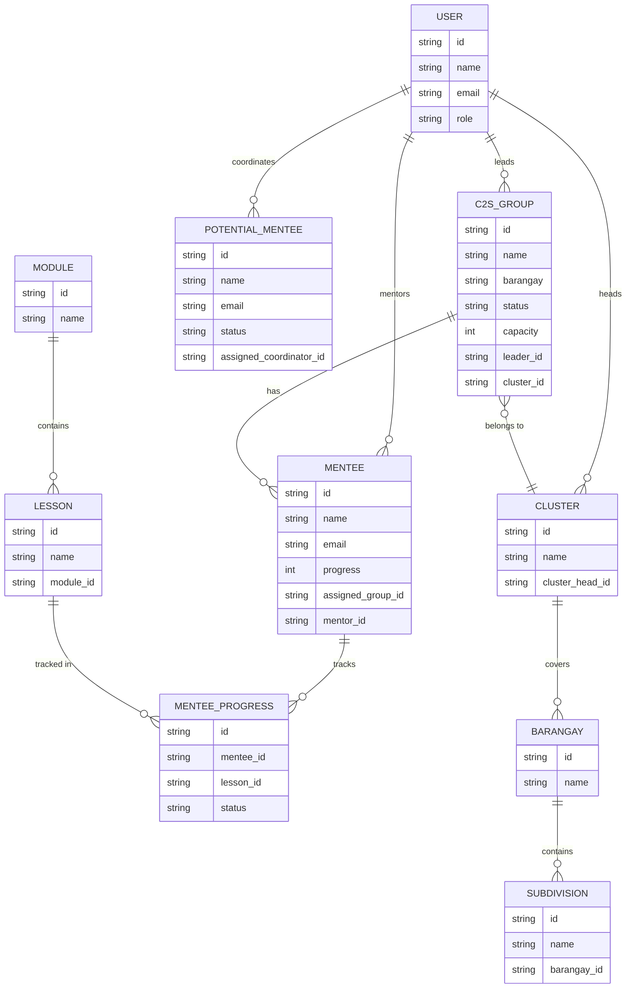
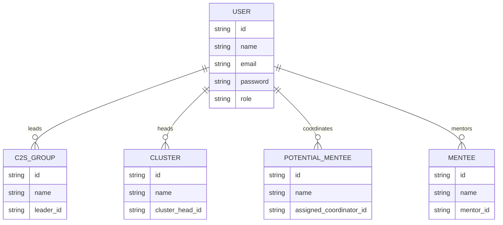
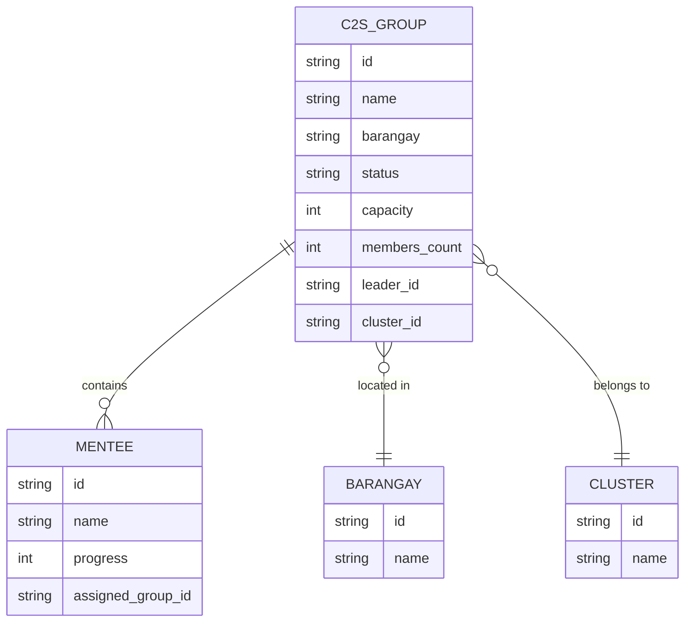
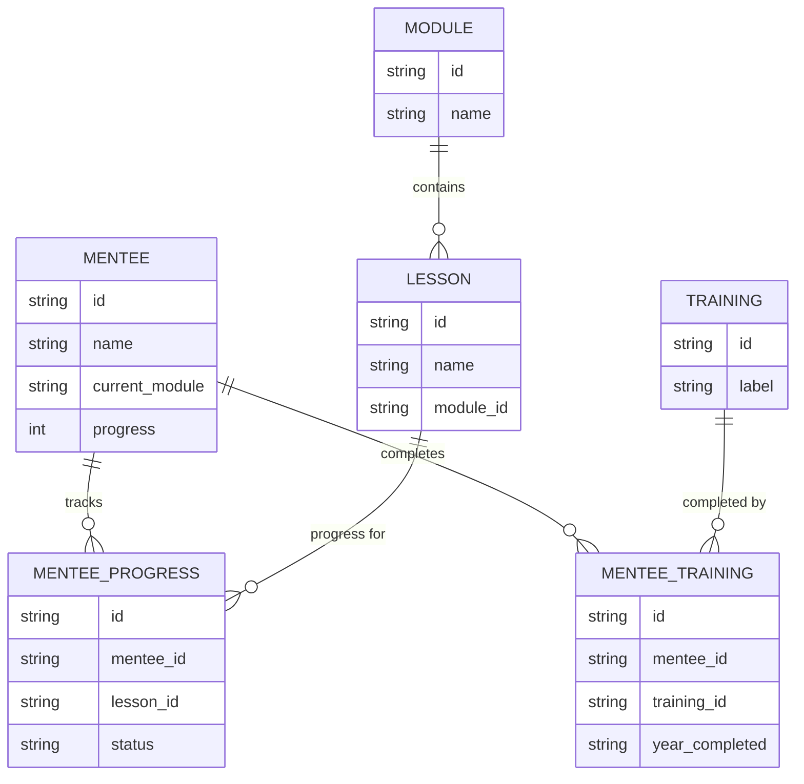
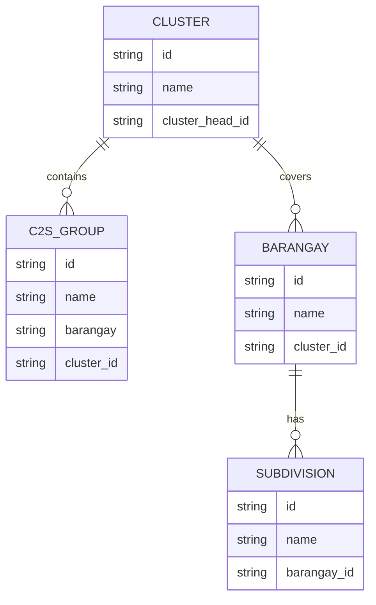
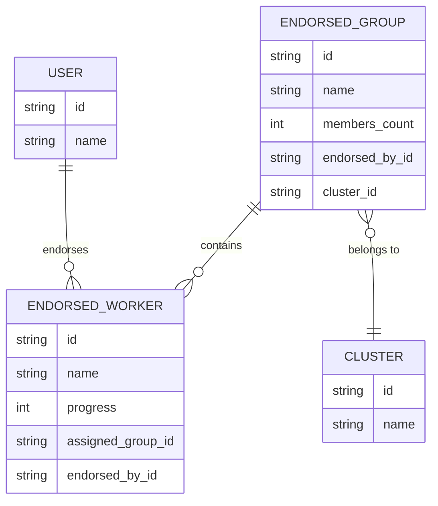

# C2S System - Entity Relationship Diagram

## 1. Complete System ERD



## 2. User Management



## 3. Group and Mentee Management



## 4. Progress Tracking



## 5. Geographic Organization



## 6. Leadership Pipeline



---

## Database Tables Summary

### Core Entities (18 Tables)

1. **USER** - Authentication and user roles
2. **C2S_GROUP** - Discipleship groups
3. **GROUP_TAG** - Tags for categorizing groups
4. **GROUP_TAG_MAPPING** - Many-to-many junction table
5. **MENTEE** - Active participants
6. **POTENTIAL_MENTEE** - Incoming requests
7. **INACTIVE_MENTEE** - Historical records
8. **TRAINING** - Training programs (CLDP, LIFE, etc.)
9. **MENTEE_TRAINING** - Training completion records
10. **ENDORSED_GROUP** - Groups led by endorsed workers
11. **ENDORSED_WORKER** - Leadership pipeline
12. **CLUSTER** - Geographic/organizational clusters
13. **BARANGAY** - City subdivisions
14. **SUBDIVISION** - Communities within barangays
15. **ACTIVITY_LOG** - System notifications and activities
16. **MODULE** - Curriculum modules
17. **LESSON** - Individual lessons
18. **MENTEE_PROGRESS** - Detailed progress tracking

### Key Relationships

- **One-to-Many**: USER → MENTEE, C2S_GROUP → MENTEE, CLUSTER → BARANGAY
- **Many-to-Many**: C2S_GROUP ↔ GROUP_TAG, MENTEE ↔ TRAINING
- **Hierarchical**: MODULE → LESSON → MENTEE_PROGRESS

---

## Complete SQL Schema

```sql
-- Users and Authentication
CREATE TABLE user (
    id VARCHAR(50) PRIMARY KEY,
    name VARCHAR(255) NOT NULL,
    email VARCHAR(255) UNIQUE NOT NULL,
    password VARCHAR(255) NOT NULL,
    role ENUM('ministry_head', 'mentor', 'cluster_head', 'c2s_coordinator') NOT NULL,
    avatar VARCHAR(10),
    group_id VARCHAR(50),
    cluster_id VARCHAR(50),
    created_at TIMESTAMP DEFAULT CURRENT_TIMESTAMP,
    updated_at TIMESTAMP DEFAULT CURRENT_TIMESTAMP ON UPDATE CURRENT_TIMESTAMP
);

-- C2S Groups
CREATE TABLE c2s_group (
    id VARCHAR(50) PRIMARY KEY,
    name VARCHAR(255) NOT NULL,
    description TEXT,
    age_group VARCHAR(50),
    location VARCHAR(255),
    barangay VARCHAR(255),
    schedule VARCHAR(255),
    status ENUM('Open', 'Closed', 'Full') DEFAULT 'Open',
    type ENUM('Community-based', 'Church-based'),
    capacity INT DEFAULT 10,
    members_count INT DEFAULT 0,
    latitude DECIMAL(10, 8),
    longitude DECIMAL(11, 8),
    leader_id VARCHAR(50),
    cluster_id VARCHAR(50),
    created_at TIMESTAMP DEFAULT CURRENT_TIMESTAMP,
    updated_at TIMESTAMP DEFAULT CURRENT_TIMESTAMP ON UPDATE CURRENT_TIMESTAMP,
    FOREIGN KEY (leader_id) REFERENCES user(id),
    FOREIGN KEY (cluster_id) REFERENCES cluster(id)
);

-- Mentees
CREATE TABLE mentee (
    id VARCHAR(50) PRIMARY KEY,
    name VARCHAR(255) NOT NULL,
    email VARCHAR(255),
    phone VARCHAR(50),
    age INT,
    gender ENUM('Male', 'Female'),
    birthday DATE,
    current_module VARCHAR(255),
    current_lesson VARCHAR(255),
    progress INT DEFAULT 0,
    status ENUM('Active', 'Pending Review', 'Inactive') DEFAULT 'Active',
    assigned_group_id VARCHAR(50),
    mentor_id VARCHAR(50),
    created_at TIMESTAMP DEFAULT CURRENT_TIMESTAMP,
    updated_at TIMESTAMP DEFAULT CURRENT_TIMESTAMP ON UPDATE CURRENT_TIMESTAMP,
    FOREIGN KEY (assigned_group_id) REFERENCES c2s_group(id),
    FOREIGN KEY (mentor_id) REFERENCES user(id)
);

-- Potential Mentees
CREATE TABLE potential_mentee (
    id VARCHAR(50) PRIMARY KEY,
    name VARCHAR(255) NOT NULL,
    email VARCHAR(255),
    phone VARCHAR(50),
    barangay VARCHAR(255),
    status ENUM('Pending', 'Accepted', 'Recommended') DEFAULT 'Pending',
    cluster_status VARCHAR(50),
    date_submitted DATE,
    assigned_coordinator_id VARCHAR(50),
    assigned_mentor_id VARCHAR(50),
    created_at TIMESTAMP DEFAULT CURRENT_TIMESTAMP,
    updated_at TIMESTAMP DEFAULT CURRENT_TIMESTAMP ON UPDATE CURRENT_TIMESTAMP,
    FOREIGN KEY (assigned_coordinator_id) REFERENCES user(id),
    FOREIGN KEY (assigned_mentor_id) REFERENCES user(id)
);

-- Clusters
CREATE TABLE cluster (
    id VARCHAR(50) PRIMARY KEY,
    name VARCHAR(255) NOT NULL,
    description TEXT,
    cluster_head_id VARCHAR(50),
    coordinator_id VARCHAR(50),
    created_at TIMESTAMP DEFAULT CURRENT_TIMESTAMP,
    FOREIGN KEY (cluster_head_id) REFERENCES user(id)
);

-- Barangays
CREATE TABLE barangay (
    id VARCHAR(50) PRIMARY KEY,
    name VARCHAR(255) NOT NULL,
    city VARCHAR(100) DEFAULT 'Dasmariñas',
    cluster_id VARCHAR(50),
    FOREIGN KEY (cluster_id) REFERENCES cluster(id)
);

-- Subdivisions
CREATE TABLE subdivision (
    id VARCHAR(50) PRIMARY KEY,
    name VARCHAR(255) NOT NULL,
    barangay_id VARCHAR(50),
    FOREIGN KEY (barangay_id) REFERENCES barangay(id)
);

-- Modules and Lessons
CREATE TABLE module (
    id VARCHAR(50) PRIMARY KEY,
    name VARCHAR(255) NOT NULL,
    sequence_order INT
);

CREATE TABLE lesson (
    id VARCHAR(50) PRIMARY KEY,
    name VARCHAR(255) NOT NULL,
    sequence_order INT,
    module_id VARCHAR(50),
    FOREIGN KEY (module_id) REFERENCES module(id)
);

-- Progress Tracking
CREATE TABLE mentee_progress (
    id VARCHAR(50) PRIMARY KEY,
    mentee_id VARCHAR(50),
    lesson_id VARCHAR(50),
    completion_date DATE,
    status VARCHAR(50),
    created_at TIMESTAMP DEFAULT CURRENT_TIMESTAMP,
    FOREIGN KEY (mentee_id) REFERENCES mentee(id),
    FOREIGN KEY (lesson_id) REFERENCES lesson(id)
);

-- Training
CREATE TABLE training (
    id VARCHAR(50) PRIMARY KEY,
    label VARCHAR(255) NOT NULL,
    description TEXT,
    sequence_order INT
);

CREATE TABLE mentee_training (
    id VARCHAR(50) PRIMARY KEY,
    mentee_id VARCHAR(50),
    training_id VARCHAR(50),
    year_completed VARCHAR(10),
    status VARCHAR(50),
    FOREIGN KEY (mentee_id) REFERENCES mentee(id),
    FOREIGN KEY (training_id) REFERENCES training(id)
);
```

---

## How to View These Diagrams

### Option 1: GitHub/GitLab
- Push this file to your repository
- Automatic Mermaid rendering

### Option 2: Mermaid Live Editor
1. Go to https://mermaid.live/
2. Copy ONE diagram code block at a time
3. Paste and view
4. Export as PNG/SVG/PDF

### Option 3: VS Code
1. Install extension: "Markdown Preview Mermaid Support"
2. Open this file
3. Click preview button

### Option 4: Draw.io / Lucidchart
- Use the SQL schema above to manually create professional ERD
- Full control over layout and styling

---

## Quick Reference

| Relationship Type | Notation | Example |
|------------------|----------|---------|
| One to Many | `||--o{` | USER leads many GROUPS |
| Many to One | `}o--||` | Many GROUPS belong to one CLUSTER |
| Zero or One | `||--o|` | Optional relationship |
| Many to Many | `}o--o{` | Requires junction table |

**Legend:**
- `||` = Exactly one
- `o|` = Zero or one
- `}o` = Zero or more
- `}{` = One or more
