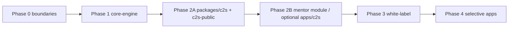

# Plan: Core Engine → C2S Module → White-Label Platform

**Status:** Phase 1 Slice A in progress (`@studio/core-engine` scaffolded — approval engine + email + action-response + tenant stub)  
**Priority order:** (1) `packages/core-engine` → (2) C2S as a separate module → (3) white-label / selective apps  
**Non-goal for early phases:** Splitting every Studio sidebar item into `apps/[module]`.

Related reading: [`ONBOARDING.md`](./ONBOARDING.md), [`architecture.md`](./architecture.md), [`PLATFORM_ARCHITECTURE.md`](./PLATFORM_ARCHITECTURE.md).

---

## Goals

1. **Core engine** — one shared package for authz, approvals, notifications/audit hooks, Prisma access patterns, and (later) tenant/branding config.
2. **C2S as a first-class module** — domain logic + UI extractable from the Studio monolith; public surface can deploy separately.
3. **White-label path** — churches/orgs can run branded instances without forking the repo.
4. Keep **one staff product** (`apps/web` / Studio) for tightly coupled ops modules (workers, schedule, reservations).

## Non-goals (near term)

- One App Hosting backend per sidebar module
- Separate Postgres per module
- Rewriting inventory/tract-tracker onto core-engine in phase 1–2
- Full multi-tenant Auth isolation on day one (can follow branding)

---

## Target shape (end state sketch)

```text
packages/
  core-engine/          # auth ctx, withPermission, approvals, audit, notify, tenant config
  database/             # Prisma client (existing)
  ui/                   # design system + CSS variables / brand tokens
  c2s/                  # C2S domain service + types (no Next pages)

apps/
  web/                  # Studio shell — most staff modules stay here
  c2s/                  # Optional: mentor/admin C2S app (phase 2B)
  c2s-public/           # Optional: public Group Finder only (phase 2A)
  inventory/            # existing separate product
  tract-tracker/        # existing mobile product
```

**Rule:** packages hold logic; apps hold routing + deployables. Core-engine never imports `apps/*`.

---

## Phase 0 — Baseline & boundaries

**Outcome:** Agreed module map and freeze on “what is core vs product.”

| Task | Detail |
|---|---|
| Inventory core candidates | `lib/auth/with-permission.ts`, `firebase-auth-server.ts`, `services/approval-engine.ts`, `email-service.ts` / notification center, `action-response.ts`, permission registry |
| Inventory C2S surface | `services/c2s.ts`, `actions/c2s.ts`, `app/c2s/**`, `app/public/c2s-join/**`, C2S branches in `db.ts` / `use-approvals.ts` / ORS sync |
| Document coupling | Mentors = `Worker.id`; join requests = `ApprovalWorkflow`; public = no auth |
| Success criteria | Short ADR in this doc (below) signed off; no code moves yet |

**Exit:** Team agrees Phase 1 package API sketch.

---

## Phase 1 — `packages/core-engine` (PRIORITY)

**Outcome:** Studio and future apps import the same authz + approval primitives.

### 1.1 Scaffold package

```text
packages/core-engine/
  package.json          # name: @studio/core-engine
  src/
    index.ts
    auth/
      types.ts          # CallerCtx
      resolve-caller.ts # Worker + roles lookup (inject getServerUser)
      with-permission.ts
      action-response.ts
    approvals/
      engine.ts         # move from services/approval-engine.ts
      types.ts
    tenant/
      types.ts          # TenantConfig stub (brandName, logoUrl, colors, featureFlags)
      defaults.ts
    notify/             # thin façade over existing email/in-app (or re-export)
```

Workspace wiring: root `package.json` workspaces already include `packages/*`.

### 1.2 Move / re-export (strangler)

| Step | Action |
|---|---|
| A | Copy approval-engine + auth wrappers into package; keep `apps/web` files as **re-exports** so imports don’t break |
| B | Point `apps/web` actions/services at `@studio/core-engine` |
| C | Delete thin re-export shims once greps are clean |
| D | Add package unit tests for `createWorkflow` / `decide` / permission deny paths |

### 1.3 API design constraints

- `resolveCallerCtx` must accept an injected `getUser()` so Next App Hosting and later Cloud Functions / other apps can share logic without hard-coding Next `cookies()`.
- `withPermission` stays the only privileged write gate for server actions.
- Approvals stay generic (`type`, stages, metadata) — C2S-specific sync stays in `@studio/c2s` / web.

### 1.4 Tenant stub (white-label foundation, minimal)

Add `TenantConfig` with defaults for COG Dasma:

```ts
type TenantConfig = {
  id: string;
  brandName: string;
  logoUrl?: string;
  primaryColor?: string;
  featureFlags: Record<string, boolean>;
};
```

No multi-DB yet — single tenant from env (`TENANT_ID`, `NEXT_PUBLIC_BRAND_NAME`, etc.).

### Phase 1 exit criteria

- [x] `@studio/core-engine` builds in the monorepo *(Slice A: package + re-exports)*
- [x] `apps/web` uses it for approval engine *(via `@/services/approval-engine` re-export)*
- [x] `apps/web` uses it for `withPermission` *(Slice B — injectable `configureAuthUserGetter`)*
- [ ] No behavior change on `/approvals` or C2S join approve/reject *(smoke after deploy)*
- [x] `npm run typecheck` passes

**Slice A landed:** `packages/core-engine` owns `action-response`, `EmailService`, approval `engine`, and `TenantConfig` stub. Web keeps thin re-export shims.

**Slice B landed:** `resolveCallerCtx` / `withPermission` / `withPublicAction` / worker-management helpers live in core-engine. Web configures Firebase via `configureAuthUserGetter(getServerUser)`.

**Risks:** Circular imports (`core-engine` → `database` only; never → `apps/web`). Email/Resend env must remain available wherever `createWorkflow` notifies.

---

## Phase 2 — C2S as a separate module (PRIORITY #2)

Split into **2A public** then **2B authenticated**, both on `@studio/core-engine` + shared Postgres.

### Phase 2A — `packages/c2s` + public app (recommended first ship)

**Outcome:** Group Finder + join form can live outside Studio chrome.

| Task | Detail |
|---|---|
| Create `packages/c2s` | Move `listPublicC2SGroups`, `createC2SJoinRequest`, mentee/session helpers from `services/c2s.ts` |
| Keep approval side-effect | `syncC2SJoinRequestFromWorkflow` lives in `@studio/c2s`; Studio `decideApprovalStage` calls it |
| Create `apps/c2s-public` | Next app with `/` = current `/public/c2s-join` UI; uses `@studio/ui`, `@studio/c2s`, `@studio/core-engine` (public actions only) |
| App Hosting | New backend **or** path-based later; start with separate App Hosting backend + domain (e.g. `c2s.<tenant>.org`) |
| Studio | Keep `/public/c2s-join` as redirect to public app **or** thin re-export page during transition |

**Exit:** Public join works on standalone URL; requests still appear in Studio `/approvals` + mentor inbox.

### Phase 2B — Authenticated C2S module / optional `apps/c2s`

**Outcome:** Mentor “My Group” (+ optional admin dashboard) no longer buried only in Studio monolith code.

| Task | Detail |
|---|---|
| Move mentor UI | `app/c2s/**`, `my-group/components/**` → either stay in Studio importing `@studio/c2s` **or** new `apps/c2s` |
| Auth | Same Firebase project; `resolveCallerCtx` from core-engine; `mentor` flag + `mentorship:*` |
| Minimal shell | Own layout (logo from TenantConfig); link “Open Studio” optional |
| Leave in Studio | Worker CRUD, role assignment, ORS C2S import tab, global approvals Kanban |

**Decision gate before 2B:**  

- **Option M1 (safer):** C2S stays a route module in `apps/web` but all logic is in `packages/c2s` (module boundary without new deploy).  
- **Option M2:** New `apps/c2s` deploy (true separate app).  

Recommend **M1 first**, then **M2** only if product/ops wants a separate mentor URL.

### Phase 2 exit criteria

- [ ] `@studio/c2s` owns domain logic; web only pages/actions wrappers
- [ ] Public Group Finder deployable without Studio nav
- [ ] Join → approval → mentee creation unchanged
- [ ] ORS import still works from Studio settings

---

## Phase 3 — White-label hardening

**Outcome:** Second tenant can be configured without forking.

| Task | Detail |
|---|---|
| Branding | CSS variables + logo/name from `TenantConfig`; replace hard-coded “Church of God Dasmariñas” in public C2S header |
| Feature flags | `featureFlags.c2s`, `featureFlags.reservations`, etc. gate nav + packages |
| Data tenancy | Add `tenantId` to core tables **or** one DB per tenant (decide per cost/compliance) |
| Auth tenancy | Firebase multi-tenancy **or** single project + custom claims `tenantId` |
| Admin console | Later `apps/admin-console` to provision tenants / brands |

**Exit:** One codebase, two brands (staging tenant + COG) smoke-tested.

---

## Phase 4 — Selective product apps (only if needed)

Promote to `apps/[product]` only when audience or deploy cadence differs:

| Candidate | When |
|---|---|
| `apps/c2s-public` | Done in 2A |
| `apps/c2s` | Mentors need standalone PWA / separate domain |
| `apps/inventory` | Already separate |
| `apps/tract-tracker` | Already separate |
| Schedule / workers / reservations | **Stay in Studio** unless a clear product split appears |

Do **not** auto-create `apps/meals`, `apps/schedule`, etc.

---

## Suggested sequence (execution order)



1. Phase 0 sign-off  
2. Phase 1 core-engine (this is the critical path)  
3. Phase 2A C2S package + public app  
4. Pause → review DX, deploy cost, auth friction  
5. Phase 2B mentor extraction (package-only or new app)  
6. Phase 3 white-label  
7. Phase 4 only with a product reason  

---

## First implementation slices (when we leave planning)

### Slice A — Core engine scaffold (start here)

1. Add `packages/core-engine` with `CallerCtx`, re-exported `action-response`, moved `approval-engine`.
2. Re-export from `apps/web/src/services/approval-engine.ts` → package.
3. Smoke: approve a C2S join request + a room reservation.

### Slice B — Auth gate into core-engine

1. Move `withPermission` / `resolveCallerCtx` with injectable `getServerUser`.
2. Update a handful of actions; then bulk replace imports.

### Slice C — `@studio/c2s` + public page move

1. Move service functions.
2. Wire `apps/web` public page to package.
3. Scaffold `apps/c2s-public` copying UI.

---

## Effort & risk (technical, not calendar)

| Phase | Invasiveness | Main risk |
|---|---|---|
| 1 core-engine | Medium — many import paths | Broken auth/approval if move is incomplete |
| 2A public C2S | Low–Medium | Dual URLs / CORS / env secrets on second App Hosting backend |
| 2B mentor app | Medium | Session cookies across subdomains; RBAC drift |
| 3 white-label | High if row-level tenant | Data migration; Auth tenancy design |
| 4 many apps | High | Ops overhead; cross-app deep links |

---

## Decision record (fill in at Phase 0 exit)

| Decision | Options | Choice |
|---|---|---|
| Mentor C2S deploy | M1 package-in-Studio / M2 `apps/c2s` | _TBD after 2A_ |
| Tenancy model | Shared DB + `tenantId` / DB-per-tenant | _TBD Phase 3_ |
| Public C2S domain | Subdomain vs path on Studio | _TBD 2A_ |
| Keep `/public/c2s-join` redirect | Yes / temporary dual | _TBD 2A_ |

---

## What to do next

1. Review this plan and lock Phase 0 decisions (especially mentor M1 vs M2).  
2. Start **Slice A** (`packages/core-engine` scaffold + approval-engine move).  
3. After core-engine is green, start **Slice C** (`packages/c2s` + public app).

Say when to begin Slice A and whether mentor C2S should target **M1 (package only)** or **M2 (separate app)** after the public split.
