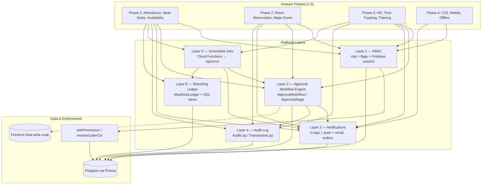
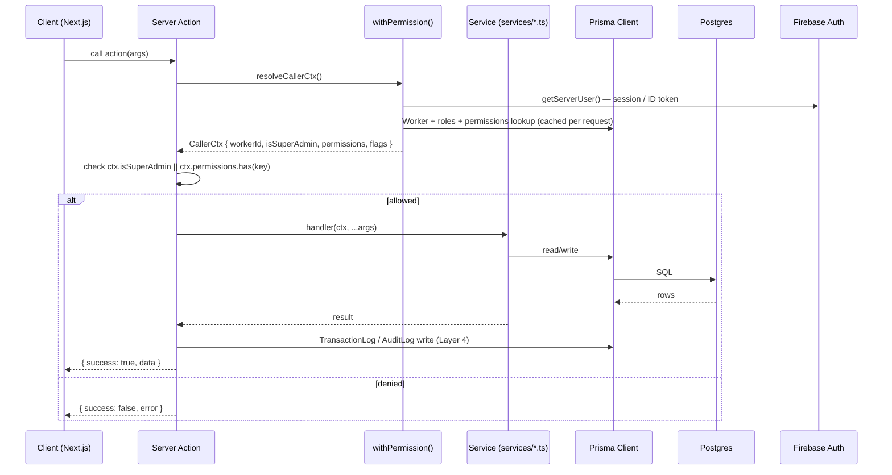
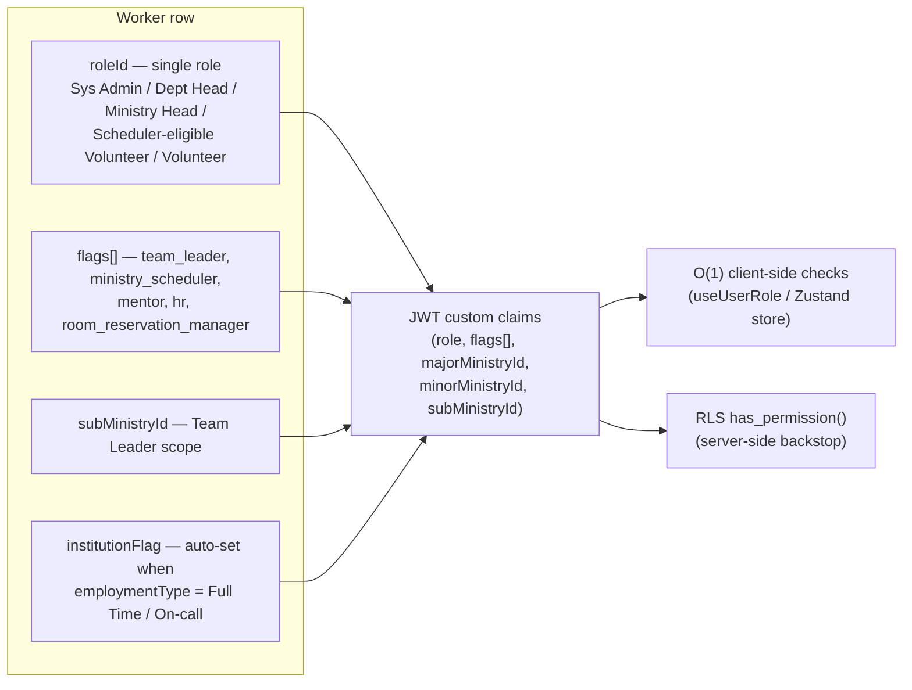
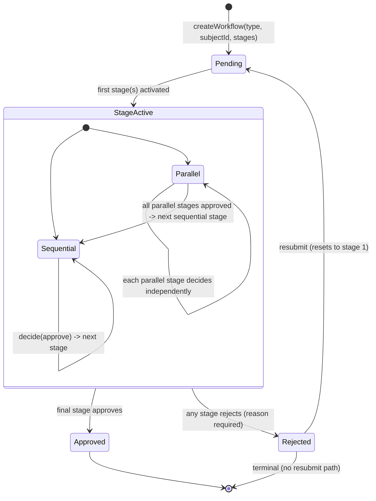
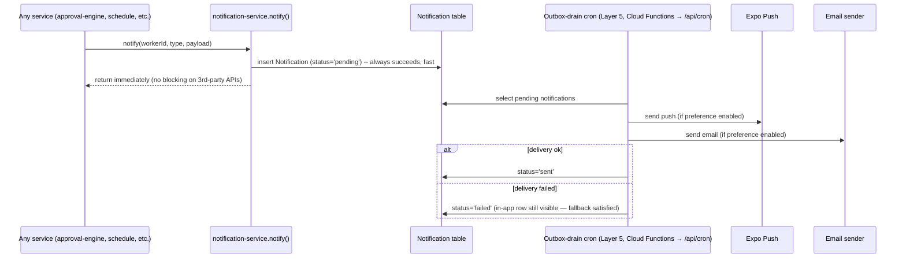
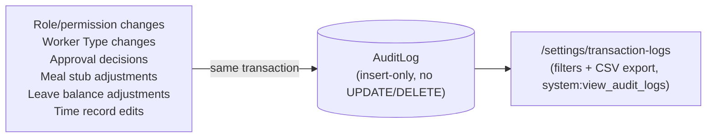
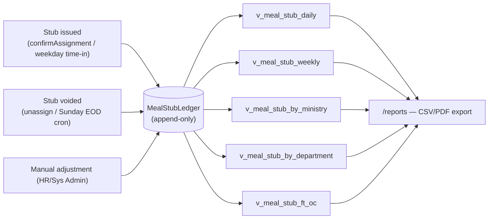
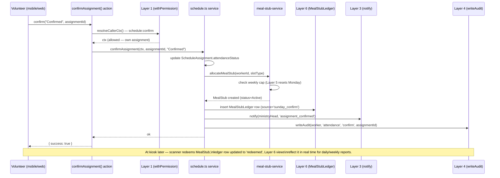

# COG App — Platform Architecture & Layer Interaction

Companion to the implementation roadmap (`.claude/plans/precious-popping-treehouse.md`).
This doc explains **how the 6 platform layers fit together**, the request/data
flow through them, and gives a worked end-to-end example (Sunday attendance →
meal stub) so new feature work has a concrete pattern to follow.

**Runtime for `apps/web`:** Firebase Auth + Firebase App Hosting + Prisma/Postgres
(source of truth), with Cloud Functions for HTTP API/schedulers and Firestore as
a dual-write soak. Start with [`SYSTEM_ARCHITECTURE.md`](./SYSTEM_ARCHITECTURE.md),
then [`ONBOARDING.md`](./ONBOARDING.md) and [`architecture.md`](./architecture.md).

---

## 1. Layer stack

Each feature phase (Phases 1-5) is built **on top of** these layers — it should
rarely need to invent its own auth check, approval state machine, notification
delivery, or audit write.

**Reading it:** a feature like "Major Event Request" (Phase 2) doesn't write its
own approval state machine or notification code — it calls Layer 2
(`approval-engine.ts`) to create/advance a workflow, which itself calls Layer 3
(`notify()`) on every state change and Layer 4 (`writeAudit()`) on every
decision. Layer 1 (RBAC via Firebase session → Worker permissions) gates who can
call any of this in the first place.

---

## 2. Request flow (every privileged action, current pattern)

**Primary enforcement:** `withPermission()` / `resolveCallerCtx()` (in-process,
React `cache()` per request). Cloud Functions verify Firebase ID tokens separately.
Historical Postgres RLS policies may still exist from the Supabase era; `apps/web`
does not rely on browser Supabase clients.

### 2.1 `withPublicAction` — self-service exceptions to the rule above

A handful of Server Actions in `apps/web/src/actions/db.ts` are wrapped in
`withPublicAction` instead of `withPermission`, because every signed-in worker
needs to call them for their own record (no single `permissionKey` fits "the
caller may edit themselves"). **These still gate privileged fields internally**
— `withPublicAction` only means "no single static permission key", not "no
authorization":

- **`createWorker`** (signup/ORS import) — accepts the new-worker payload as-is
  only if the caller (or an anonymous signup) is authorized via
  `canManageWorkersInMinistries()`. Otherwise privileged fields (`roleId`,
  `status`, `flags`, `subMinistryId`, `employmentType`, `majorMinistryId`,
  `minorMinistryId`) are overwritten with the same safe defaults the signup
  form sends (`roleId: 'viewer'`, `status: 'Pending Approval'`, no
  ministries/flags).
- **`updateWorker`** (profile page + admin worker management) — a fixed
  `SELF_SERVICE_WORKER_FIELDS` allowlist (`firstName`, `lastName`, `phone`,
  `address`, `avatarUrl`, `qrToken`, `passwordChangeRequired`, `firstLogin`,
  `birthday`, `gender`) may always be changed on the caller's **own** record.
  Any other field — role, status, ministries, RBAC `flags`, `subMinistryId`,
  `employmentType`, `capabilities`, etc. — or any edit to **someone else's**
  record, requires `canManageWorker(ctx, targetId)` (super admin, a
  `workers:*`/`manage_workers` permission, or Ministry Head/Approver of the
  target's ministries). Changing `employmentType` additionally requires
  `worker_type:change`, `isHR` (Worker.flags), or super admin.
- **`claimSystemAdmin`** — the one-time bootstrap that seeds the default Role
  rows and promotes the caller to Admin. Only succeeds while
  `prisma.role.count() === 0` (system never initialized), so it cannot be
  replayed afterwards. Replaces the old open `upsertRole` + `updateWorker({roleId:'admin'})`
  combo, which had no such guard.

These helpers live in `apps/web/src/lib/auth/with-permission.ts`
(`canManageWorker`, `canManageWorkersInMinistries`, `isHRWorker`) — reuse them
rather than re-deriving "is this caller allowed to touch this worker" logic
in new actions.

---

## 3. Layer 1 — RBAC: role + flags + JWT claims

- **Single role** drives coarse module permissions (via `RolePermission`).
- **Flags** layer on *scoped* capabilities that don't fit a role hierarchy
  (e.g. a Volunteer can also be a `mentor` for C2S, or a `room_reservation_manager`
  inside the Admin Department).
- **`subMinistryId`** lets a `team_leader` flag be scoped to one ministry
  without needing a whole separate role.
- **`institutionFlag`** is derived, not set manually — HR setting
  `employmentType` to Full Time/On-call flips it, which downstream (Phase 3)
  drives weekday meal stub + master schedule eligibility.

---

## 4. Layer 2 — Approval Workflow engine

One generic engine serves all four approval shapes in the SRD:

| Workflow type | Shape | Stages |
|---|---|---|
| Minor Ministry assignment | 1-stage | Minor Ministry Head |
| Room Reservation | 3-stage sequential | Ministry Head → Dept Head → Room Reservation Manager (flag) |
| Leave / Request | 4-stage sequential | Worker → Ministry Head → HR → Admin Dept Head |
| Major Event Request | parallel → sequential | (Ministry Head per selected ministry, parallel) → Admin Dept Head |

Every `decide()` call:
1. Validates "reason required on reject".
2. Advances `ApprovalStage`/`ApprovalWorkflow.status`.
3. Calls `notify()` (Layer 3) for the subject + next approver(s).
4. Calls `writeAudit()` (Layer 4) with before/after stage status.

---

## 5. Layer 3 — Notifications (outbox pattern)

The in-app notification centre always reflects the `Notification` row
immediately — push/email are best-effort side channels drained asynchronously,
so a flaky push provider never blocks the user-facing request.

---

## 6. Layer 4 — Audit Log

`writeAudit(actor, module, action, subjectType, subjectId, before, after, reason)`
is called **in the same transaction** as the underlying write — never as a
fire-and-forget afterthought for these specific actions (unlike the lighter
`TransactionLog` used for general action logging today).

---

## 7. Layer 5 — Scheduled jobs (cron)

```mermaid
gantt
    dateFormat HH:mm
    axisFormat %H:%M
    title Weekly cron timeline (Firebase Cloud Functions → App Hosting /api/cron)
    section Sunday
    Void unused FT/OC weekday stubs (EOD)      :a1, 00:00, 1h
    section Monday 00:00
    Reset 2,000 meal stub cap + allocations    :a2, 00:00, 1h
    Allocate 5 inactive weekday stubs to FT/OC :a3, 00:00, 1h
    section Daily
    Unconfirmed-assignment reminders           :a4, 08:00, 1h
    Late-flag sweep (time-in vs schedule)      :a5, 09:00, 1h
    section Every minute
    Notification outbox drain                  :a6, 00:00, 1h
```

All jobs are **idempotent** (re-running doesn't double-allocate/void) and call
Layer 4 (`writeAudit`) for any state-changing action, so resets are traceable.

---

## 8. Layer 6 — Reporting ledger

Reports never recompute from raw `MealStub` rows — they read pre-aggregated
views over the ledger, so report generation stays O(rows in range) regardless
of total historical stub volume.

---

## 9. Worked example: Sunday attendance confirmation → meal stub

This is the highest-frequency flow in the app (every volunteer, every Sunday)
and touches almost every layer — use it as the template for new features.

If a worker **declines** instead, the same path runs but `allocateMealStub` is
skipped and (if a replacement is found) `emergency reassignment` (Phase 1 item
4) creates a new `ApprovalWorkflow`-free direct notification to the
replacement, who then runs this same confirm flow.

---

## 10. Where new code plugs in (quick reference)

| Need | Use |
|---|---|
| Check "can this user do X" server-side | `withPermission(PERMISSIONS.module.action, handler)` |
| Check "can this user do X" client-side | `useUserRole()` (Zustand store, derived from JWT claims) |
| Multi-stage approval | `approval-engine.ts` — `createWorkflow()` / `decide()` |
| Tell a user something happened | `notification-service.notify(workerId, type, payload)` |
| Record a sensitive change | `writeAudit(actor, module, action, subjectType, subjectId, before, after, reason)` |
| Time-based reset/sweep | Handler in `services/cron-jobs.ts` + `/api/cron/*`, triggered by Cloud Functions scheduler |
| Stub/financial reporting | Write to `MealStubLedger`, read via `v_meal_stub_*` views |
| New table | Migration includes RLS policy using `has_permission()` / `is_super_admin()` in the same file |

---

## 11. User stories → architecture mapping

Each story below names the **role** (single `Role` + `flags[]` from Layer 1),
the **phase** it belongs to, and which layers/diagrams it exercises. Use this
as the acceptance-criteria source when building a phase — if a story can't be
satisfied by the layers it references, the layer is missing something.

### Volunteer (every member with a ministry assignment)

| # | Story | Phase | Layers exercised |
|---|---|---|---|
| V1 | As a Volunteer, I want to confirm or decline my Sunday assignment from the app within the confirmation window, so the ministry knows who's showing up. | 1 | §2 Request flow, §9 worked example |
| V2 | As a Volunteer, when I confirm a Main/Mid slot I want my meal stub to activate automatically, and an Open slot only counts if I'm serving two consecutive services. | 1 | §6 Audit (stub issuance), §8 Reporting ledger |
| V3 | As a Volunteer, if I decline, I want the system to notify my Ministry Scheduler so they can find a replacement without me having to message anyone. | 1 | §5 Notifications |
| V4 | As a Volunteer, I want to set my recurring unavailability (e.g. "never Wednesdays") so I'm not assigned to slots I can't serve. | 1 | §1 Layer stack (Availability feeds scheduler scoring) |
| V5 | As a Volunteer assigned to a service in my *minor* ministry, I want that assignment to require my Minor Ministry Head's approval before it's final. | 1 | §4 Approval engine (1-stage), §5 Notifications, §7 Audit |
| V6 | As a Volunteer, I want a single notification centre showing schedule, approval, and meal-stub updates — even if push notifications fail. | 1, 4 | §5 Notification outbox |
| V7 | As a Volunteer who is Full-Time/On-Call, I want my weekday meal stub to activate when I scan in, and to stay inactive on my approved leave days. | 3 | §1 RBAC (`institutionFlag`), §7 Cron, §9 worked-example pattern |

### Ministry Scheduler (`flags` includes `ministry_scheduler`)

| # | Story | Phase | Layers exercised |
|---|---|---|---|
| MS1 | As a Ministry Scheduler, I want to build and publish a Sunday schedule with Main/Mid/Open slots, and have the system enforce the Open-slot consecutive-pair rule for me. | 1 | §1 RBAC, §9 worked example |
| MS2 | As a Ministry Scheduler, when a volunteer declines, I want to see eligible replacements ranked by availability and recent assignment load, and reassign in one action. | 1 | §1 (Availability), §5 Notifications |
| MS3 | As a Ministry Scheduler, I want to see how many meal stubs my ministry has used against its weekly allocation before I over-assign. | 1 | §6 Audit, §8 Reporting ledger |

### Ministry Head (`Ministry.headId === worker.id`)

| # | Story | Phase | Layers exercised |
|---|---|---|---|
| MH1 | As a Ministry Head, I want to assign or remove Ministry Schedulers for my ministry without needing Sys Admin. | 1 | §1 RBAC (`canAssignSchedulers` fix), §6 Audit |
| MH2 | As a Ministry Head, I want to approve or reject Minor Ministry assignment requests for volunteers whose minor ministry is mine, with a mandatory reason on rejection. | 1 | §4 Approval engine (1-stage), §5 Notifications |
| MH3 | As a Ministry Head, I want to be the stage-1 approver on my ministry's room reservation requests, and see the request return to the requester (not vanish) if I reject it. | 2 | §4 Approval engine (3-stage), §5 Notifications |
| MH4 | As a Ministry Head, when a Major Event Request involves my ministry, I want my approval to run in parallel with other involved ministries — not blocked waiting on them. | 2 | §4 Approval engine (parallel → sequential) |

### Department Head

| # | Story | Phase | Layers exercised |
|---|---|---|---|
| DH1 | As a Department Head, I want to be the stage-2 approver for room reservations in my department, after the Ministry Head has approved. | 2 | §4 Approval engine (3-stage) |
| DH2 | As a Department Head, I want to be the final sequential approver for a Major Event Request after all involved Ministry Heads have approved in parallel. | 2 | §4 Approval engine |
| DH3 | As a Department Head, I want to be the 4th-stage approver on Leave & Request filings after HR has reviewed. | 3 | §4 Approval engine (4-stage) |

### Room Reservation Manager (`flags` includes `room_reservation_manager`)

| # | Story | Phase | Layers exercised |
|---|---|---|---|
| RRM1 | As a Room Reservation Manager, I want to be the final-stage approver on room reservations regardless of which ministry/department submitted them. | 2 | §1 RBAC (flag-scoped permission), §4 Approval engine |
| RRM2 | As a Room Reservation Manager, I want to assign display devices to rooms and see bookings update in real time on those displays without a page refresh. | 2 | §1 RBAC; room displays use Firestore pings / polling (not Supabase Realtime) |

### HR (`flags` includes `hr`)

| # | Story | Phase | Layers exercised |
|---|---|---|---|
| HR1 | As HR, I want to change a worker's Employment Type to Full-Time/On-Call and have their `institutionFlag` and weekday meal-stub eligibility update automatically. | 1, 3 | §1 RBAC (`worker_type:change`), §6 Audit |
| HR2 | As HR, I want to review and approve Leave & Request filings at stage 3 (after the Ministry Head), and have approval update the worker's leave balance. | 3 | §4 Approval engine (4-stage), §6 Audit |
| HR3 | As HR, I want to set each worker's master schedule (shift times, days off) and grace period, and get a daily report of late/incomplete time records. | 3 | §7 Cron (late-flag sweep), §5 Notifications |
| HR4 | As HR (or whoever Open Decision #2 assigns), I want to record training completions per worker without it blocking scheduling for v1. | 3 | §1 RBAC |

### Mentor (`flags` includes `mentor`)

| # | Story | Phase | Layers exercised |
|---|---|---|---|
| MT1 | As a Mentor, I want to see my C2S group's schedule, location, and current module, and update the current module as we progress. | 4 | §1 RBAC |
| MT2 | As a Mentor, I want anonymous join requests for my group to come to me for approval via a single-stage workflow, with the requester notified by email of my decision. | 4 | §4 Approval engine (1-stage, public-facing) |
| MT3 | As a Mentor, I want to record per-session attendance for my mentees. | 4 | — |

### System Administrator

| # | Story | Phase | Layers exercised |
|---|---|---|---|
| SA1 | As Sys Admin, I want a single screen to set a worker's role, flags, and (for Team Leaders) their sub-ministry scope — not juggle multiple role assignments. | 1 | §1 RBAC, §3 RBAC diagram |
| SA2 | As Sys Admin, I want every role/permission/worker-type/approval/financial-adjustment change recorded in an insert-only audit log I can filter and export. | 1-3 | §6 Audit Log |
| SA3 | As Sys Admin, I want the 2,000-stub weekly cap, per-ministry allocations, and global toggles (e.g. Major Event button) configurable without code changes. | 1, 2 | §7 Cron, §8 Reporting ledger |
| SA4 | As Sys Admin, I want weekly resets (meal stub cap, weekday stub voiding, leave balances) to run automatically even if no one opens the app that day. | 1, 3 | §7 Cron timeline |
| SA5 | As Sys Admin, I want kiosk devices (meal scanner, weekday scanner, room displays) authenticated with per-device credentials, not a shared hardcoded password. | cross-cutting | Security fixes section of the roadmap |

### Kiosk (device, not a user)

| # | Story | Phase | Layers exercised |
|---|---|---|---|
| K1 | As the Sunday meal stub scanner, I want to redeem a worker's active stub, mark it `redeemed`, and write a ledger row — all in one atomic action. | 1 | §8 Reporting ledger |
| K2 | As the weekday FT/OC scanner, I want a time-in scan to activate that day's pre-allocated stub and feed the late-flag sweep. | 3 | §7 Cron, §8 Reporting ledger |
| K3 | As the room display, I want to subscribe to booking changes for my assigned room and update within seconds — no polling. | 2 | §1 RBAC (device→room assignment) |
