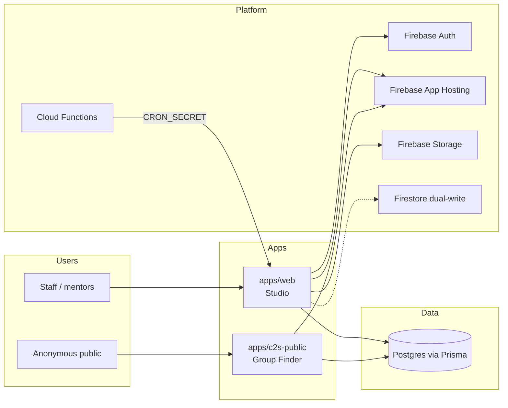
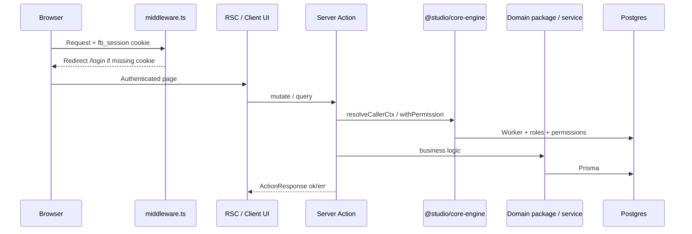

# Studio — System Architecture

**Audience:** engineers joining or extending this monorepo.  
**Stack (current):** Firebase Auth + Firebase App Hosting + Postgres (Prisma SoT) + Cloud Functions.  
**Live Studio:** `https://studio--cog-app-studio.asia-southeast1.hosted.app`  
**Firebase project:** `cog-app-studio`

This is the **canonical architecture overview**. Use it first; dig into the linked docs for depth.

**Offline / shareable copy:** [`SYSTEM_ARCHITECTURE.docx`](./SYSTEM_ARCHITECTURE.docx) (same content, Word format).

| Doc | Use when |
|---|---|
| [`ONBOARDING.md`](./ONBOARDING.md) | Day-1 setup, first PR |
| [`architecture.md`](./architecture.md) | “Where do I change X?” route/file map |
| [`PLATFORM_ARCHITECTURE.md`](./PLATFORM_ARCHITECTURE.md) | RBAC / approvals / notify / audit / cron “why” |
| [`CORE_ENGINE_C2S_PLAN.md`](./CORE_ENGINE_C2S_PLAN.md) | Extraction / white-label history |
| [`CUSTOM_DOMAINS.md`](./CUSTOM_DOMAINS.md) | Branded hosts (**deferred**) |
| [`AGENTS.md`](../AGENTS.md) | Cloud/dev gotchas + deploy |

---

## 1. What the product is

**COG Studio** is a church operations platform (Church of God Dasmariñas today; white-label-ready branding).

Staff work in **one Studio app** (`apps/web`): workers, schedule, reservations, meals, C2S mentor UI, inventory, approvals, settings, etc.

Public surfaces that need a different deploy/audience are **separate apps** (today: C2S Group Finder).

---

## 2. System context



**Rules of thumb**

1. **Postgres is source of truth** for Studio business data (Prisma).  
2. **Firebase Auth** is the identity provider (session cookie for Next).  
3. **Server Actions** are the primary write path from the UI (not ad-hoc API routes).  
4. **Domain packages** hold reusable logic; **apps** hold routes, UI, and deploy config.  
5. Do **not** invent a new auth check, approval engine, or email helper — use `@studio/core-engine`.

---

## 3. Monorepo layout

```text
studio/
├── apps/
│   ├── web/                 # Studio (flagship) — App Hosting root
│   └── c2s-public/          # Public C2S Group Finder (port 9004)
├── packages/
│   ├── core-engine/         # Authz, approvals, email, tenant/URLs
│   ├── c2s/                 # C2S domain (groups, mentees, join sync)
│   ├── inventory/           # Inventory domain (items, stock, borrowings)
│   ├── database/            # Prisma client export
│   ├── ui/                  # Shared shadcn/ui
│   ├── store/               # Zustand permissions / impersonation
│   ├── types/               # Shared TS types
│   ├── client/              # GraphQL/Apollo (limited use)
│   └── graphql/             # GraphQL schema
├── functions/               # Firebase Cloud Functions (HTTP API + schedulers)
├── prisma/schema.prisma     # Postgres schema (SoT)
├── apphosting.yaml          # Studio App Hosting
└── docs/
```

**Sunset (do not restore without a product decision):**

- `apps/tract-tracker` — removed  
- `apps/inventory` — removed; inventory UI lives in Studio `/inventory`

---

## 4. Runtime request flow (Studio)



| Concern | Location |
|---|---|
| Session gate (cookie presence) | `apps/web/src/middleware.ts` |
| Firebase Admin session verify | `apps/web/src/lib/firebase-auth-server.ts` |
| Wire Auth → core-engine | `apps/web/src/lib/auth/with-permission.ts` (`configureAuthUserGetter`) |
| Permission registry | `apps/web/src/lib/permissions/registry.ts` |
| Client permission flags | `apps/web/src/store/user-role-syncer-sql.tsx` + `@studio/store` |

**Client-safe import:** never import `@studio/core-engine` barrel from client components (pulls server deps). Use `@studio/core-engine/tenant` for branding/URLs.

---

## 5. Shared packages (platform contracts)

### `@studio/core-engine`

Platform primitives used by Studio and future apps:

| Area | API |
|---|---|
| Action envelope | `ok` / `err` / `ActionResponse` |
| Authz | `configureAuthUserGetter`, `resolveCallerCtx`, `withPermission`, `withPublicAction` |
| Approvals | `createWorkflow`, `decide`, `getActiveStages`, … |
| Email | `EmailService` (Resend) |
| Tenant / URLs | `getTenantConfig`, `tenantDisplayName`, `isFeatureEnabled`, `moduleAppUrl`, `c2sPublicUrl` |

Module URL pattern (when DNS exists): `https://[module].[domain].app` via `NEXT_PUBLIC_ROOT_DOMAIN` (default `cogdasma.app`). **Custom domains are deferred** — use App Hosting default URLs + env overrides today.

### `@studio/c2s`

Connect2Souls domain: public groups, join requests + approval sync, mentor groups/sessions/mentees, admin CRUD helpers, Kanban row mapping.

- **UI (staff):** `apps/web` `/c2s`, `/c2s/my-group`  
- **UI (public):** `apps/c2s-public`  
- **Studio redirect:** `/public/c2s-join` → `c2sPublicUrl()` unless `NEXT_PUBLIC_C2S_EMBEDDED=true`

### `@studio/inventory`

Inventory domain: categories, items, stock, borrowings, import, reports, event picker list.

- **UI:** `apps/web` `/inventory/**` only  
- **Actions:** `apps/web/src/actions/inventory.ts` (permission wrappers)

### Other packages

| Package | Role |
|---|---|
| `@studio/database` | Prisma client |
| `@studio/ui` | Shared UI kit |
| `@studio/store` | Zustand auth/permissions client state |
| `@studio/types` | Shared types |
| `@studio/graphql` / `@studio/client` | Limited GraphQL path |

---

## 6. Feature modules in Studio (`apps/web`)

| Module | Routes (approx.) | Domain location |
|---|---|---|
| Workers / RBAC | `/workers`, `/settings/roles` | `actions` + `services` in web |
| Schedule | `/schedule`, `/worker/schedule` | web services + public token pages |
| Reservations / venue | `/reservations`, `/venue` | web + approval workflows |
| Meals | `/meals` | web + ledger / cron |
| Approvals | `/approvals` | `@studio/core-engine` + type-specific sync |
| C2S | `/c2s`, `/c2s/my-group` | `@studio/c2s` |
| Inventory | `/inventory/**` | `@studio/inventory` |
| Events / sermons / pastoral | `/events`, `/public/sermons`, … | web services |
| Settings / ORS | `/settings/**` | web (ORS stays in Studio) |

Feature flags (`NEXT_PUBLIC_FEATURE_*`) gate nav for `c2s`, `reservations`, `schedule`, `inventory`, `meals`.

---

## 7. Platform layers (build on these)

See [`PLATFORM_ARCHITECTURE.md`](./PLATFORM_ARCHITECTURE.md) for detail.

| Layer | Purpose | Entry points |
|---|---|---|
| 1 RBAC | Who can act | `withPermission`, permissions registry, Worker roles |
| 2 Approvals | Multi-stage workflows | `@studio/core-engine` approvals; type sync in domain packages |
| 3 Notifications | In-app / email | notification center + `EmailService` |
| 4 Audit | Who changed what | `writeAudit` / `TransactionLog` |
| 5 Cron | Scheduled jobs | Cloud Functions → `/api/cron/*` + `CRON_SECRET` |
| 6 Ledgers | Reporting (e.g. meal stubs) | ledger tables + views |

**Pattern for a new write feature**

1. Add/adjust Prisma models in `prisma/schema.prisma`.  
2. Put pure business logic in a domain package (or `apps/web/src/services/*` if not extracted yet).  
3. Expose a Server Action that uses `withPermission` / `withPublicAction`.  
4. Call from UI via React Query.  
5. If multi-step approval is needed, use `createWorkflow` / `decide` — don’t invent a parallel status machine.  
6. Audit + notify as needed.

---

## 8. Deploy & environments

| Piece | How |
|---|---|
| Studio hosting | Firebase App Hosting — repo root, `apphosting.yaml`, `npm run apphosting:build` |
| C2S public hosting | Separate App Hosting backend — `apps/c2s-public/apphosting.yaml` |
| Functions / rules | `.github/workflows/firebase-deploy.yml` on `main` (`FIREBASE_TOKEN`) |
| PR check | `.github/workflows/firebase-pr.yml` validates App Hosting config |
| Vercel | **Removed** from this repo |

**Do not** set `buildCommand` in `apphosting.yaml` (strips npm workspaces).

Local:

```bash
npm install
npx prisma generate
# apps/web/.env.local — see ONBOARDING.md
npm run dev:web          # :9002
npm run dev:c2s-public   # :9004
```

---

## 9. Auth & tenancy (current vs future)

| Topic | Current | Future / open |
|---|---|---|
| Identity | Single Firebase project | Multi-tenant Auth or claims `tenantId` |
| Branding | Env-driven `TenantConfig` | More portals / Capcitor names if needed |
| Data tenancy | Single DB / single org | `tenantId` columns **or** DB-per-tenant |
| Module hosts | Code supports `[module].[domain].app` | **DNS deferred** — default App Hosting URLs |

---

## 10. Open tasks / backlog

Prioritized for contributors. Check GitHub issues/PRs before starting.

### P0 — Ops / reliability (recommended soon)

| ID | Task | Notes |
|---|---|---|
| T1 | Ensure Cloud Functions deploy works (`FIREBASE_TOKEN` secret) | Needed for cron → `/api/cron/*` |
| T2 | Confirm `APP_BASE_URL` / `CRON_SECRET` on Functions + App Hosting | Schedulers must reach Studio |
| T3 | Postgres SQL helpers: `fn_room_bookings_for_date` (and any missing fns) | Workers already has Prisma fallback for search; bookings may still fail without fn/fallback |
| T4 | Signup phone required vs payload drift | Pre-existing schema/UI mismatch |

### P1 — Product / platform (when prioritized)

| ID | Task | Notes |
|---|---|---|
| T5 | Deploy / smoke `apps/c2s-public` on App Hosting | Point Studio redirect via `NEXT_PUBLIC_C2S_PUBLIC_URL` or module URL override until custom DNS |
| T6 | Local C2S workflow | `NEXT_PUBLIC_MODULE_URL_C2S=http://localhost:9004` and/or `NEXT_PUBLIC_C2S_EMBEDDED=true` |
| T7 | Second-brand smoke test | Different `NEXT_PUBLIC_BRAND_*` + `NEXT_PUBLIC_FEATURE_*=false` on a staging backend |
| T8 | Multi-tenant data/auth decision | Required before a second live org |
| T9 | Mentor C2S M2 (`apps/c2s`) | Only if mentors need a separate PWA/host; M1 (package-in-Studio) is done |

### P2 — Deferred / optional

| ID | Task | Notes |
|---|---|---|
| T10 | Custom domains `c2s.cogdasma.app` / `studio.cogdasma.app` | **Deferred** — see `CUSTOM_DOMAINS.md` |
| T11 | Extract more domains (`@studio/schedule`, reservations, …) | Only when reuse or testability demands it |
| T12 | Move remaining web inventory/C2S shims fully off re-exports | Cosmetic cleanup |
| T13 | Staff print / Capacitor native display names | Still COG-hardcoded in places |
| T14 | Archive or rewrite historical `.kiro` overhaul specs | Still mention removed apps / Supabase Edge plan |

### Explicitly out of scope

- Restoring `apps/tract-tracker` or standalone `apps/inventory`  
- Splitting every Studio sidebar item into its own App Hosting backend  
- One Postgres database per sidebar module  

---

## 11. Definition of done for a typical change

- [ ] Touches the right layer (package vs action vs UI)  
- [ ] Privileged writes go through `withPermission` / `requirePermission`  
- [ ] `npm run typecheck` (or at least `apps/web` `tsc`) passes  
- [ ] No client import of `@studio/core-engine` barrel  
- [ ] Docs updated if you change deploy shape, package boundaries, or module URLs  

---

## 12. Quick “where do I…?”

| Goal | Start here |
|---|---|
| Add a staff page | `apps/web/src/app/...` + nav in `components/layout/nav.tsx` |
| Add a privileged mutation | `actions/*.ts` + domain service/package |
| Change approval behavior | `@studio/core-engine` + type-specific sync in domain package |
| Change C2S public join | `apps/c2s-public` + `@studio/c2s` |
| Change inventory rules | `@studio/inventory` + `actions/inventory.ts` |
| Change branding / feature flags | `@studio/core-engine/tenant` + env vars |
| Change schema | `prisma/schema.prisma` → `npx prisma db push` (local) |
| Change cron | `functions/src/index.ts` + `apps/web/src/app/api/cron/*` |

---

*Last updated to match post–core-engine / C2S / inventory extraction state. Prefer this doc over older prompts that mention Vercel or Supabase Auth for `apps/web`.*
