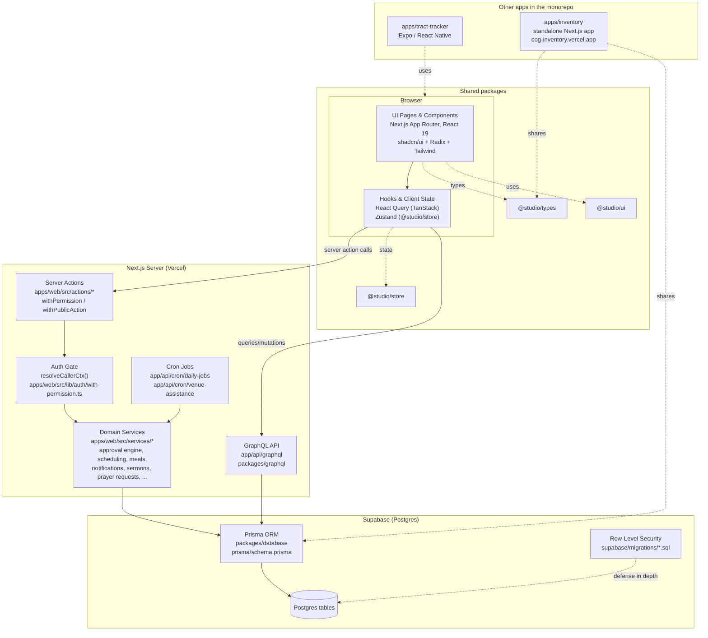
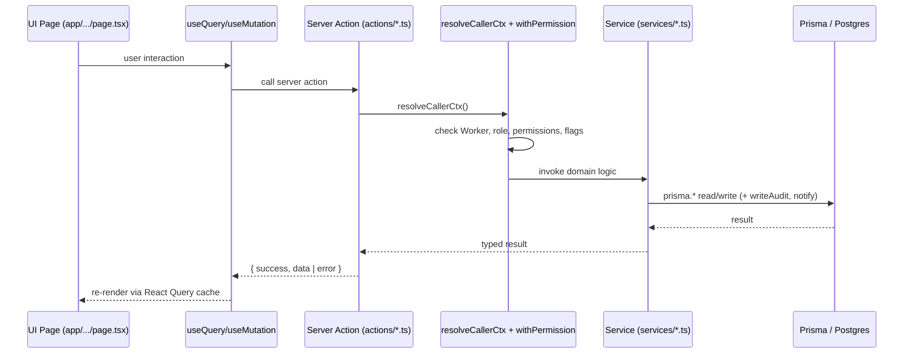

# COG App — Architecture & Navigation Map

A practical map of how the system is put together and **where to make a
change**. For the deeper design rationale behind RBAC, the approval engine,
notifications, audit log, cron jobs, and the meal-stub reporting ledger, see
[`PLATFORM_ARCHITECTURE.md`](./PLATFORM_ARCHITECTURE.md) — that doc covers the
"why"; this doc covers the "where".

For what each module/role can *do*, see [`user-stories.md`](./user-stories.md).

## 1. High-level layers & tech stack

**Tech stack (verified against `package.json`):**

| Layer | Technology |
|---|---|
| Framework | Next.js 15 (App Router), React 19, TypeScript 5 |
| UI | `@studio/ui` (shadcn/ui on Radix primitives), Tailwind CSS, lucide-react icons |
| Client state / data fetching | TanStack React Query 5, Zustand 5 (`@studio/store`) |
| Forms / validation | React Hook Form, Zod |
| ORM / DB | Prisma 5.22 → Supabase Postgres, with Row-Level Security as a second line of defense |
| Auth | Supabase Auth (session via `resolveCallerCtx()`) |
| Notifications | In-app `InAppNotification` centre + Resend (`EmailService`) |
| Scheduled work | Vercel Cron → `app/api/cron/*`, secured by `CRON_SECRET` |
| GraphQL | `packages/graphql` (schema) + `packages/client` (Apollo client), used by mobile/other consumers |
| Other apps | `apps/inventory` (separate Next.js app, deployed at cog-inventory.vercel.app, shares `@studio/database`/`@studio/types`); `apps/tract-tracker` (Expo/React Native mobile app, own Supabase project/migrations) |
| Deployment | Vercel (`apps/web` → cog-app-v2.vercel.app) |

## 2. Request flow (typical authenticated write)

Public-facing flows (e.g. `/public/events`, `/public/prayer-requests`,
`/public/c2s-join`) use `withPublicAction` — no `resolveCallerCtx()`/Worker
required, but the underlying tables are locked down via RLS so only the
specific insert the action performs is allowed anonymously.

## 3. File map — where logic lives

| Logic layer | Directory / files | What's there | Notes |
|---|---|---|---|
| **Routes / pages** | `apps/web/src/app/**/page.tsx` | One folder per route (App Router). Admin pages wrap content in `AppLayout`; public pages (`app/public/**`) render standalone with a gradient background, no nav. | See §4 for the full route list. |
| **Layout / nav** | `apps/web/src/components/layout/` | `app-layout.tsx`, `nav.tsx` (sidebar nav tree + `permissionKey` gating per item) | New admin pages get a nav entry here. |
| **Shared UI components** | `packages/ui/src/` | shadcn/Radix-based components (`Button`, `Dialog`, `Table`, `Switch`, `Card`, etc.) re-exported as `@studio/ui` | Add new primitives here, not per-app. |
| **Hooks** | `apps/web/src/hooks/` (29 files) | `use-user-role.tsx` (permission flags), `use-toast.ts`, feature hooks (`use-*-data` style) | `use-user-role` is the main gate for client-side `can*` checks. |
| **Client state / permissions store** | `packages/store/src/permissions.store.ts` | Zustand store holding `canManage*` booleans (`PermissionsState`/`DEFAULT_STATE`) | New permission flags are added here first. |
| **Permission sync** | `apps/web/src/store/user-role-syncer-sql.tsx` | Derives the `permissionsPayload` (e.g. `canManageContent = isSuperAdmin \|\| hasPerm('content:manage')`) and feeds the Zustand store | Wire new flags here. |
| **Permission registry** | `apps/web/src/lib/permissions/registry.ts` | `PERMISSIONS`, `ALL_PERMISSIONS` (seed list), `WORKER_FLAGS`, `LEGACY_PERMISSION_MAP` | Source of truth for `module:action` strings; seeded via `actions/seed-permissions.ts`. |
| **Auth gate** | `apps/web/src/lib/auth/with-permission.ts` | `resolveCallerCtx()`, `withPermission`, `withPublicAction` | Every authenticated server action is wrapped here. |
| **Server actions** | `apps/web/src/actions/*.ts` (18 files) | Thin wrappers: auth check → call a service → return `{ success, data \| error }`. One file per domain area (`schedule.ts`, `events.ts`, `sermons.ts`, `prayer-requests.ts`, `leave.ts`, `training.ts`, `c2s.ts`, `venue-assistance.ts`, `major-events.ts`, `availability.ts`, `ors-sync.ts`, `notifications.ts`, `ministry-categories.ts`, `db.ts`, `auth.ts`, `legacy-auth.ts`, `seed-permissions.ts`) | This is the boundary client code calls into. |
| **Domain services** | `apps/web/src/services/*.ts` (24 files) | Actual business logic + Prisma queries. Notable: `approval-engine.ts` (generic workflow engine), `notification-center.ts`/`notification-service.ts`, `email-service.ts`, `cron-jobs.ts`, `schedule.ts`/`master-schedule.ts`, `meal-stub-engine.ts`/`meal-stub-service.ts`/`meals-attendance.ts`, `leave-workflow.ts`, `room-reservation-workflow.ts`, `major-event-workflow.ts`, `minor-ministry-assignment-workflow.ts`, `c2s.ts`, `sermons.ts`, `prayer-requests.ts`, `events.ts`, `training.ts`, `roles.ts`, `workers.ts`, `availability.ts`, `ors-sync.ts`, `venue-assistance*.ts` | New features get a new service file here; this is "where the logic is". |
| **Database schema** | `packages/database/prisma/schema.prisma` (Prisma) + `supabase/migrations/*.sql` | Models for Workers, Roles/Permissions, Schedule, Approvals, Notifications, Audit (`TransactionLog`), Meal stubs/ledger, Leave, Training, C2S, Sermons, EventSignup, PrayerRequest, Inventory, Venue/Reservations, Major Events | Each migration also adds RLS policies; Prisma-only tables get deny-all RLS (locked down to server-role access). |
| **Shared types** | `packages/types/src/` | TS types mirroring Prisma models + DTOs shared between `apps/web`, `apps/inventory`, and mobile | Add new model types here when adding a Prisma model. |
| **Cron jobs** | `apps/web/src/app/api/cron/daily-jobs/`, `.../venue-assistance/` | Vercel Cron endpoints, `CRON_SECRET`-gated, call into `services/cron-jobs.ts` and `services/venue-assistance-notifications.ts` | Idempotent + audit-logged (Layer 5 in PLATFORM_ARCHITECTURE.md). |
| **GraphQL API** | `apps/web/src/app/api/graphql/`, `packages/graphql/src/schema.ts`, `packages/client/src/` | Schema + Apollo client used for cross-app/mobile data access | Smaller surface than server actions; extend only if a non-web consumer needs it. |
| **Inventory app** | `apps/inventory/src/app/**`, `.../components`, `.../hooks`, `.../lib`, `.../utils` | Separate Next.js app, deployed independently (cog-inventory.vercel.app), linked from the main nav under "Inventory" (`canAccessInventory`) | Shares `@studio/database` + `@studio/types` with `apps/web`. |
| **Mobile app (Tract Tracker)** | `apps/tract-tracker/src/{screens,components,context}`, own `supabase/migrations` | Expo/React Native app, separate Supabase project | Unrelated to the COG App roadmap's "Mobile app (6.1)" item — pre-existing app in the monorepo. |
| **Docs** | `docs/` | `PLATFORM_ARCHITECTURE.md` (layer design + Mermaid diagrams + Phase 1-4 user stories), `roadmap-progress.md` (checklist of shipped work), `user-stories.md` / `architecture.md` (this pair), schema dump, plans | Start here when onboarding. |

## 4. Route map (apps/web)

| Route | Purpose | Gate |
|---|---|---|
| `/dashboard` | Landing page after login | any authenticated worker |
| `/worker/schedule` | Worker's own upcoming assignments (formerly `/my-schedule`, which now redirects here) | any authenticated worker |
| `/worker/schedule/published` | Worker-facing month-calendar "portal" of all `Published` service schedules; click a date to open the read-only `/schedule/[id]` view (formerly `/my-schedule/published`) | any authenticated worker |
| `/worker/schedule/[token]` | Public token-based read-only view of a published service schedule (formerly `/public/schedule/[token]`, which now redirects here); exempted from the auth gate in `middleware.ts` via a dedicated regex since it lives under the otherwise-authenticated `/worker/*` prefix | none (token-based) |
| `/schedule`, `/schedule/[id]`, `/schedule/templates`, `/schedule/schedulers` | Build/publish Sunday service schedules, templates, assign Ministry Schedulers (`/schedule` has List/Month calendar tabs via shared `MonthCalendar` component) | `canManageSchedule` / `canAssignSchedulers` |
| `/reservations`, `/reservations/new`, `/reservations/my`, `/reservations/calendar`, `/reservations/all`, `/reservations/masterview`, `/reservations/masterview/daily` | Room reservation request/approval flow + master schedule calendar | mixed — request is open to workers, masterview/all gated |
| `/meals`, `/mealstub`, `/mealstub/scanner` | Meal stub viewing, assignment, scanning | `canViewMealStubs` / `isMealStubAssigner` / `attendance:scan_meal` |
| `/c2s` | C2S mentor "My Group" management | `canManageC2S` (mentor flag) |
| `/approvals` | Unified inbox for all approval-engine workflow types | `canManageApprovals` |
| `/workers`, `/workers/[id]`, `/workers/my-qr` | Worker directory/profile management, personal QR code | `canManageWorkers` (directory) / any worker (`my-qr`) |
| `/ministries`, `/ministries/[id]` | Ministry/department management | `canManageMinistries` |
| `/attendance`, `/attendance/scanner`, `/scan` | Attendance logs + scanner kiosks | `canViewAttendance` / `attendance:scan_*` |
| `/reports` | System reports | `canViewReports` |
| `/events`, `/events/[id]` | Church event management, incl. "Make Public" toggle + sign-up list | event management permission; public toggle gated by `canManageContent` |
| `/major-events` | Major Event Request module | `major_events:*` |
| `/leave` | Worker leave/request filing, balances, history | any FT worker (HR/Admin manage via approvals) |
| `/training` | Training records (self-view + manager view) | any worker (self) / `canManageTraining` (manager section) |
| `/sermons` | Sermon catalogue admin (CRUD + public toggle) | `canManageContent` |
| `/pastoral` | Prayer/counselling request inbox | `canManagePastoral` |
| `/venue`, `/venue/[bookingId]`, `/venue/command-center`, `/venue/my` | Venue assistance requests + command center | `venue_assistance:*` |
| `/settings/*` | Roles, departments, meal-stub allocation, facilities, venue elements, transaction logs, ORS sync, venue assistance config, major events config, master schedule & attendance | various `canManage*` |
| `/profile`, `/login`, `/signup`, `/auth/update-password` | Account/auth pages | open / authenticated |
| `/public/sermons` | Public sermon catalogue (Phase 5) | none (anonymous) |
| `/public/services` | Public list of published service schedules (List/Month tabs via `PublicServicesView`) → `/worker/schedule/[token]` (Phase 5) | none |
| `/public/events` | Public upcoming events + sign-up form (Phase 5) | none |
| `/public/prayer-requests` | Public prayer/counselling request form (Phase 5) | none |
| `/public/c2s-join` | Public C2S group join-request form (Phase 4) | none |

## 5. Where recent logic changes live

- **Phase 5 (Sermons, Public Events/Sign-ups, Prayer Requests, Public Service Directory)**:
  `services/sermons.ts`, `services/prayer-requests.ts`, `services/events.ts` (public-events
  additions), `actions/sermons.ts`, `actions/prayer-requests.ts`, `actions/events.ts`
  (`getPublicEvents`/`submitEventSignup`/`getEventSignupsAction`), pages
  `app/sermons`, `app/pastoral`, `app/public/sermons`, `app/public/services`,
  `app/public/events`, `app/public/prayer-requests`, plus the `content:manage`
  and `pastoral:manage` permissions (registry → store → syncer → nav).
- **Phase 4 (C2S completion)**: `services/c2s.ts`, `actions/c2s.ts`, `app/c2s`
  "My Group" tab, `app/public/c2s-join`, wired into `approval-engine.ts` via
  `getC2SJoinRequestApprovals`.
- **Phase 3 (HR & Time Tracking, Training)**: `services/master-schedule.ts`,
  `services/leave-workflow.ts`, `services/training.ts`, `actions/leave.ts`,
  `actions/training.ts`, `app/leave`, `app/training`, `app/settings/attendance`.
- **Phase 1-2 (attendance, meal stubs, approvals, room reservations, major events)**:
  `services/meal-stub-engine.ts`, `services/room-reservation-workflow.ts`,
  `services/major-event-workflow.ts`, `services/minor-ministry-assignment-workflow.ts`,
  `services/approval-engine.ts`, `app/approvals`, `app/reservations/*`,
  `app/major-events`.

For the underlying architectural patterns (approval engine state machine,
notification fan-out, audit log shape, cron schedule), see
[`PLATFORM_ARCHITECTURE.md`](./PLATFORM_ARCHITECTURE.md) §§2-9.
