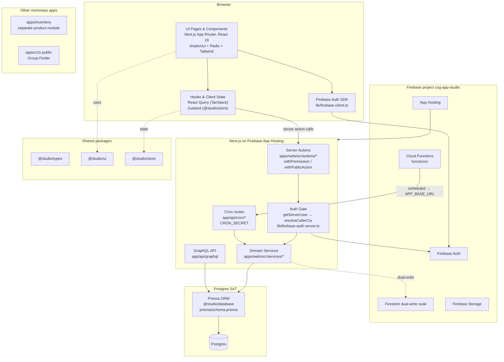
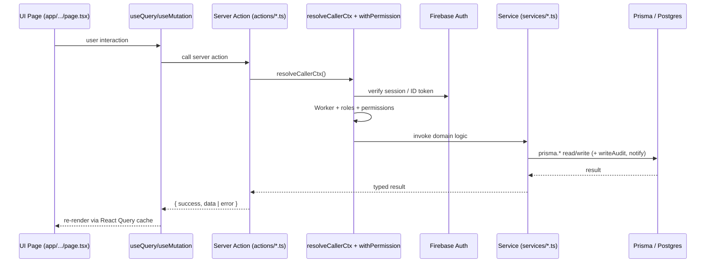

# COG App — Architecture & Navigation Map

A practical map of how the system is put together and **where to make a
change**. For the deeper design rationale behind RBAC, the approval engine,
notifications, audit log, cron jobs, and the meal-stub reporting ledger, see
[`PLATFORM_ARCHITECTURE.md`](./PLATFORM_ARCHITECTURE.md) — that doc covers the
"why"; this doc covers the "where".

**New developers:** start with [`ONBOARDING.md`](./ONBOARDING.md).

**Platform evolution:** [`CORE_ENGINE_C2S_PLAN.md`](./CORE_ENGINE_C2S_PLAN.md) —
phased plan for `packages/core-engine`, C2S as a separate module, then white-label.

For what each module/role can *do*, see [`user-stories.md`](./user-stories.md).
For a faster-to-skim orientation pass, see [`CODEBASE_GUIDE.md`](./CODEBASE_GUIDE.md).

## 1. High-level layers & tech stack

**Tech stack:**

| Layer | Technology |
|---|---|
| Framework | Next.js 15 (App Router), React 19, TypeScript 5 |
| UI | `@studio/ui` (shadcn/ui on Radix), Tailwind CSS, lucide-react |
| Client state / data fetching | TanStack React Query 5, Zustand 5 (`@studio/store`) |
| Forms / validation | React Hook Form, Zod |
| ORM / DB | Prisma 5.22 → **Postgres** (source of truth). Schema: root `prisma/schema.prisma` |
| Auth | **Firebase Auth** — browser SDK + session cookie; server via `getServerUser()` / `resolveCallerCtx()` |
| Storage / dual-write | Firebase Storage; Firestore dual-write during soak |
| Notifications | In-app `InAppNotification` + Resend (`EmailService`) |
| Scheduled work | Firebase Cloud Functions schedulers → `app/api/cron/*` (`CRON_SECRET`) |
| HTTP API | Firebase Cloud Functions (`functions/src/routes/*`) — Firebase ID token auth |
| GraphQL | `packages/graphql` + `packages/client` (limited / mobile consumers) |
| Other apps | `apps/inventory` (separate product), `apps/c2s-public` (Group Finder) |
| Deployment | **Firebase App Hosting** (`apphosting.yaml`, `npm run apphosting:build`) — live: `studio--cog-app-studio.asia-southeast1.hosted.app` |

Historical SQL under `supabase/migrations/` may still be applied to Postgres for indexes/functions; it is **not** a live Supabase Auth/hosting path for `apps/web`.

## 2. Request flow (typical authenticated write)

Public-facing flows (e.g. `/public/events`, `/public/prayer-requests`,
`/public/c2s-join`) use `withPublicAction` — no Worker permission required.
Authorization for privileged self-service fields still happens inside helpers
in `with-permission.ts`.

## 3. File map — where logic lives

| Logic layer | Directory / files | What's there | Notes |
|---|---|---|---|
| **Routes / pages** | `apps/web/src/app/**/page.tsx` | One folder per route. Admin pages use `AppLayout`; `app/public/**` is anonymous. | See §4. |
| **Layout / nav** | `apps/web/src/components/layout/` | `app-layout.tsx`, `nav.tsx` (`permissionKey` gating) | New admin pages get a nav entry here. |
| **Shared UI** | `packages/ui/src/` | shadcn/Radix primitives as `@studio/ui` | Add primitives here, not per-app. |
| **Hooks** | `apps/web/src/hooks/` | React Query hooks; `use-user-role.tsx` for `can*` flags | |
| **Client permissions store** | `packages/store/src/permissions.store.ts` | Zustand `canManage*` booleans | |
| **Permission sync** | `apps/web/src/store/user-role-syncer-sql.tsx` | Firebase user → Worker → `permissionsPayload` → Zustand | Wire new flags here. |
| **Permission registry** | `apps/web/src/lib/permissions/registry.ts` | `PERMISSIONS`, `ALL_PERMISSIONS` | Seed via `actions/seed-permissions.ts`. |
| **Auth (client)** | `apps/web/src/lib/firebase-client.ts`, login/signup pages | Firebase web SDK; emulator when `NEXT_PUBLIC_FIREBASE_USE_EMULATOR=true` | |
| **Auth (server)** | `apps/web/src/lib/firebase-auth-server.ts`, `lib/auth/with-permission.ts` | `getServerUser()`, `resolveCallerCtx()`, `withPermission`, `withPublicAction` | |
| **Middleware** | `apps/web/src/middleware.ts` | Cookie session gate; public prefixes `/login`, `/signup`, `/auth`, `/public`, `/privacy`, `/api` | |
| **Server actions** | `apps/web/src/actions/*.ts` | Thin auth → service wrappers per domain | Prefer domain files over growing `db.ts`. |
| **Domain services** | `apps/web/src/services/*.ts` | Business logic + Prisma | New features get a service file here. |
| **Database schema** | **`prisma/schema.prisma`** (repo root) | Workers, RBAC, Schedule, Approvals, C2S, Inventory, etc. | Apply with `npx prisma db push` locally. Optional SQL: `supabase/migrations/*.sql` for indexes/fns. |
| **Cloud Functions** | `functions/src/` | HTTP API routers + scheduled jobs | Auth: `Authorization: Bearer <Firebase ID token>`. |
| **App Hosting** | `apphosting.yaml`, `scripts/apphosting-*.sh` | Build/start for Cloud Run-backed hosting | Do not set `buildCommand` in YAML (strips workspaces). |
| **Cron jobs** | `apps/web/src/app/api/cron/*` | `CRON_SECRET`-gated; invoked by Cloud Functions schedulers | |
| **Inventory app** | `apps/inventory/` | Separate product module; migrate toward Prisma + core-engine | Keep separate — do not fold into Studio |
| **C2S public app** | `apps/c2s-public/` | Standalone Group Finder (`@studio/c2s` + `@studio/core-engine`) | `c2s.[domain].app`; port 9004 |
| **Docs** | `docs/` | Onboarding, architecture, platform layers, plans | Start at `ONBOARDING.md`. |

## 4. Route map (apps/web)

| Route | Purpose | Gate |
|---|---|---|
| `/dashboard` | Landing page after login | any authenticated worker |
| `/worker/schedule` | Worker's own upcoming assignments | any authenticated worker |
| `/worker/schedule/published` | Month calendar of published service schedules | any authenticated worker |
| `/worker/schedule/[token]` | Public token schedule view | none (token-based; middleware exempt) |
| `/schedule`, `/schedule/[id]`, `/schedule/templates`, `/schedule/schedulers` | Build/publish Sunday schedules | `canManageSchedule` / `canAssignSchedulers` |
| `/reservations/*` | Room reservation request/approval + calendars | mixed |
| `/meals`, `/mealstub`, `/mealstub/scanner` | Meal stubs | meal stub / scan permissions |
| `/c2s`, `/c2s/my-group` | C2S mentor group management | `canManageC2S` |
| `/approvals` | Unified approval inbox | `canManageApprovals` |
| `/workers`, `/workers/[id]`, `/workers/my-qr` | Worker directory / QR | `canManageWorkers` / any worker |
| `/ministries`, `/ministries/[id]` | Ministry management | `canManageMinistries` |
| `/attendance`, `/attendance/scanner`, `/scan` | Attendance + scanners | attendance permissions |
| `/reports` | System reports | `canViewReports` |
| `/events`, `/events/[id]` | Church events | event / content permissions |
| `/major-events` | Major Event Requests | `major_events:*` |
| `/leave` | Leave requests / balances | FT workers (+ HR via approvals) |
| `/training` | Training records | self / `canManageTraining` |
| `/sermons` | Sermon catalogue admin | `canManageContent` |
| `/pastoral` | Prayer/counselling inbox | `canManagePastoral` |
| `/venue/*` | Venue assistance | `venue_assistance:*` |
| `/inventory` | Inventory (web Prisma path) | inventory permissions |
| `/settings/*` | Roles, facilities, ORS sync, attendance, etc. | various `canManage*` |
| `/profile`, `/login`, `/signup`, `/auth/update-password` | Account/auth | open / authenticated |
| `/public/sermons` | Public sermon catalogue | none |
| `/public/services` | Public schedule portal | none |
| `/public/events` | Public events + signup | none |
| `/public/prayer-requests` | Public prayer form | none |
| `/public/c2s-join` | Public C2S group finder + join | none |

## 5. Where recent logic changes live

- **Firebase cutover**: Auth (`firebase-client` / `firebase-auth-server`), App Hosting scripts, Cloud Functions under `functions/`, inventory web path on Prisma.
- **Phase 5 (public content)**: `services/sermons.ts`, `prayer-requests.ts`, `events.ts` + matching actions/pages under `app/public/*`.
- **Phase 4 (C2S)**: `@studio/c2s`, `actions/c2s.ts`, `app/c2s`, `apps/c2s-public`, redirect at `app/public/c2s-join`.
- **Phase 3 (HR / training)**: `leave-workflow.ts`, `training.ts`, `master-schedule.ts`.
- **Phase 1–2**: meal stubs, room reservation workflow, major events, `approval-engine.ts`.

For approval/notification/audit/cron patterns, see
[`PLATFORM_ARCHITECTURE.md`](./PLATFORM_ARCHITECTURE.md).
